# GACI-0003 - Registry Authority Assessment

Status: Complete
Date: 2026-07-28
Mode: Read-Only Architectural Assessment
Program: Genesis Platform Engineering Program
Constitutional Baseline: GAF-0001 (Active Frozen)

## 1. Executive Summary

This assessment establishes the Registry Authority Model for Genesis before registry convergence work. The repository contains a mixed registry ecosystem spanning governance registries, production runtime registries, platform service registries, compiler/tooling registries, and generated audit projections.

Primary outcome:
- Registry inventory completed for production-reachable and governance-critical registries, plus supporting internal/tooling registries.
- Each registry has exactly one primary classification and exactly one ownership authority.
- Duplicate and split-authority patterns are identified, with risk statements and non-implementation recommendations.

Key architectural determination:
- Authoritative registry authority is intentionally split by domain and must remain explicit:
  - Governance authority registries in genesis governance machine artifacts.
  - Platform runtime authority registries in GOP and GEA service layers.
  - Analytics authority registries in GMP persistence layer.
  - Generated GAR registry artifacts are projections and must not be treated as mutable authority sources.

## 2. Registry Inventory

Registry inventory count: 28

| ID | Registry | Path | Production Reachable |
|---|---|---|---|
| REG-001 | Governance Registry | genesis/governance/machine/governance-registry.json | No |
| REG-002 | Baseline Registry | genesis/governance/baselines/ggb-0001/machine/baseline-registry.json | No |
| REG-003 | Release Registry | genesis/governance/releases/ggr-0001/machine/release-registry.json | No |
| REG-004 | Registry Update Plan Registry | genesis/governance/decisions/gcd-0002/machine/registry-updates.json | No |
| REG-005 | GOP Module Registry | src/platform/gop/module-registry.ts | Yes |
| REG-006 | GOP Workspace Registry | src/platform/gop/workspaces/registry.ts | Yes |
| REG-007 | GOP Worker Registry | src/platform/gop/runtime/worker-registry.ts | Yes |
| REG-008 | GOP Module Loader Cache Registry | src/platform/gop/runtime/loader.ts | Yes |
| REG-009 | GOP Inspector Extension Registry | src/platform/gop/inspector/extensions.ts | Yes |
| REG-010 | GEA Tool Registry Service | src/lib/gea/tool-registry-service.ts | Yes |
| REG-011 | GEA Tool Runtime Registry | src/lib/gea/tool-framework.ts | Yes |
| REG-012 | GEA Capability Registry | src/lib/gea/capability-registry.ts | Yes |
| REG-013 | GEA Memory Registry Service | src/lib/gea/memory-registry.ts | Yes |
| REG-014 | GEA Context Cache Registry | src/lib/gea/memory-repository.ts | Yes |
| REG-015 | GMP Analytics Adapter Registry | src/lib/gmp/analytics-adapters.ts | Yes |
| REG-016 | GMP Attribution Registry | src/lib/gmp/analytics-repository.ts | Yes |
| REG-017 | GMP Recommendation Registry | src/lib/gmp/analytics-repository.ts | Yes |
| REG-018 | Compiler Pass Registry (TS) | src/compiler/core/CompilerPassRegistry.ts | No |
| REG-019 | Business Genome Pass Registry | src/compiler/genome/BusinessGenomePassRegistry.ts | No |
| REG-020 | Discovery Plugin Registry | src/compiler/discovery/DiscoveryRegistry.ts | No |
| REG-021 | Toolchain Definition Registry | tools/genesis/compiler/registry/DefinitionRegistry.mjs | No |
| REG-022 | Toolchain Renderer Registry | tools/genesis/compiler/registry/RendererRegistry.mjs | No |
| REG-023 | Toolchain Pass Registry (MJS) | tools/genesis/compiler/pipeline/CompilerPassRegistry.mjs | No |
| REG-024 | Builder Registry Contract | src/sdk/generators/BuilderRegistry.ts | No |
| REG-025 | Entity Registry Placeholder | src/core/registry/EntityRegistry.ts | No |
| REG-026 | Schema Registry Placeholder | src/domain/schema/SchemaRegistry.ts | No |
| REG-027 | GAR Registry Inventory | genesis/audits/GAR-0001/registry-inventory.json | No |
| REG-028 | GAR Registry Relationship Map | genesis/audits/GAR-0002/evidence/registry-relationship-map.json | No |

## 3. Registry Classification Matrix

Classification rule: exactly one primary classification per registry.

| ID | Primary Classification | Rationale |
|---|---|---|
| REG-001 | AUTHORITATIVE | Canonical governance artifact graph and dependencies. |
| REG-002 | AUTHORITATIVE | Canonical baseline lifecycle and supersession registry. |
| REG-003 | AUTHORITATIVE | Canonical governance release record. |
| REG-004 | TRANSITIONAL | Process update registry for governance migration actions. |
| REG-005 | RUNTIME | In-process module manifest registry for runtime bootstrap and navigation. |
| REG-006 | CONFIGURATION | Runtime workspace configuration registry seeded by workspace runtime bootstrap. |
| REG-007 | RUNTIME | Mutable operational worker state used by orchestration and worker APIs. |
| REG-008 | CACHE | Context-keyed bootstrap cache over module loading. |
| REG-009 | INTERNAL IMPLEMENTATION | Internal extension Map for inspector section registration. |
| REG-010 | AUTHORITATIVE | Persistent tool registry authority for tool definitions, lifecycle, versions, policy history. |
| REG-011 | RUNTIME | Ephemeral in-memory runtime tool catalog for execution contexts. |
| REG-012 | RUNTIME | Ephemeral in-memory capability catalog and resolution surface. |
| REG-013 | AUTHORITATIVE | Persistent memory reference registry with source and authority metadata. |
| REG-014 | CACHE | Context package cache registry in memory repository layer. |
| REG-015 | CONFIGURATION | Adapter/plugin registration surface for analytics source handling. |
| REG-016 | AUTHORITATIVE | Persistent GMP attribution registry per project. |
| REG-017 | AUTHORITATIVE | Persistent GMP recommendation registry per project. |
| REG-018 | INTERNAL IMPLEMENTATION | Compiler runtime pass registry for TS compiler pipeline. |
| REG-019 | INTERNAL IMPLEMENTATION | Business Genome pass orchestration registry over compiler pass registry. |
| REG-020 | INTERNAL IMPLEMENTATION | Discovery source plugin registry for compiler discovery engine. |
| REG-021 | INTERNAL IMPLEMENTATION | Toolchain definition registry for Genesis generator compiler. |
| REG-022 | INTERNAL IMPLEMENTATION | Toolchain renderer plugin registry for code generation outputs. |
| REG-023 | TRANSITIONAL | Legacy toolchain pass registry parallel to TS compiler registry stack. |
| REG-024 | TRANSITIONAL | Interface contract only; no concrete runtime authority implementation. |
| REG-025 | TRANSITIONAL | Empty placeholder registry file. |
| REG-026 | TRANSITIONAL | Empty placeholder registry file. |
| REG-027 | GENERATED | Generated GAR projection inventory of discovered registries. |
| REG-028 | GENERATED | Generated GAR projection graph for registry relationships. |

Classification summary:
- AUTHORITATIVE: 8
- DERIVED: 0
- PROJECTION: 0
- CACHE: 2
- RUNTIME: 4
- CONFIGURATION: 2
- GENERATED: 2
- TEST: 0
- TRANSITIONAL: 5
- INTERNAL IMPLEMENTATION: 5

## 4. Registry Ownership Matrix

Ownership rule: exactly one ownership authority per registry.

| ID | Ownership Authority | Lifecycle | Mutation Authority | Persistence Authority | Initialization Authority | Runtime Authority |
|---|---|---|---|---|---|---|
| REG-001 | Genesis Governance Authority | Versioned governance lifecycle | Governance maintainers | Git governance artifacts | Governance package updates | Governance constitution chain |
| REG-002 | Genesis Governance Baseline Authority | Baseline supersession lifecycle | Baseline maintainers | Git governance artifacts | Baseline package updates | Governance baseline control |
| REG-003 | Genesis Governance Release Authority | Release lifecycle | Release management authority | Git governance artifacts | Release package generation | Governance release process |
| REG-004 | Genesis Governance Decision Authority | Decision transition lifecycle | Decision maintainers | Git governance artifacts | GCD process tooling | Governance decision transitions |
| REG-005 | GOP Runtime Authority | Runtime lifecycle | GOP module bootstrap | In-memory only | Module bootstrap runtime | GOP runtime layer |
| REG-006 | GOP Runtime Authority | Runtime configuration lifecycle | Workspace runtime seed only | In-memory only | Workspace runtime bootstrap | GOP runtime layer |
| REG-007 | GOP Runtime Authority | Runtime operational lifecycle | Worker APIs and orchestration runtime | In-memory only | Orchestration runtime creation | GOP orchestration runtime |
| REG-008 | GOP Runtime Authority | Runtime cache lifecycle | Module loader | In-memory only | Loader cache key initialization | GOP runtime loader |
| REG-009 | GOP Runtime Authority | Runtime extension lifecycle | Extension registration functions | In-memory only | Inspector extension registration | GOP inspector subsystem |
| REG-010 | GEA Tooling Authority | Tool lifecycle and version lifecycle | Tool registry service and authorized APIs | Prisma GEA tool tables | Tool API dependency builder | GEA execution and tool APIs |
| REG-011 | GEA Tooling Authority | Runtime process lifecycle | Runtime constructors and upsert calls | In-memory only | Agent and orchestration runtime constructors | GEA/GBA agent runtimes |
| REG-012 | GEA Tooling Authority | Runtime process lifecycle | Runtime constructors and upsert calls | In-memory only | Agent and orchestration runtime constructors | GEA/GBA agent runtimes |
| REG-013 | GEA Memory Authority | Memory reference and context lifecycle | Memory registry service and authorized APIs | Prisma GEA memory tables | Memory API dependency builder | GEA memory/context services |
| REG-014 | GEA Memory Authority | Cache lifecycle | Context framework and repository writes | In-memory or Prisma cache records | Memory repository initialization | GEA context framework |
| REG-015 | GMP Analytics Authority | Adapter configuration lifecycle | Analytics adapter registry construction and register calls | In-memory only | Analytics services dependency creation | GMP analytics services |
| REG-016 | GMP Analytics Authority | Analytics attribution lifecycle | Analytics services upsert path | Prisma GMP analytics attribution table | Analytics foundation ensure config | GMP analytics services |
| REG-017 | GMP Analytics Authority | Analytics recommendation lifecycle | Analytics services upsert path | Prisma GMP analytics recommendation table | Analytics foundation ensure config | GMP analytics services |
| REG-018 | Compiler Runtime Authority | Compiler pipeline lifecycle | Compiler runtime registration calls | In-memory only | Compiler core bootstrap | Compiler runtime |
| REG-019 | Business Genome Compiler Authority | Compiler pipeline lifecycle | Business genome pass registration | In-memory only | Business genome compiler bootstrap | Business genome compiler runtime |
| REG-020 | Discovery Compiler Authority | Discovery plugin lifecycle | Discovery engine register calls | In-memory only | Discovery engine bootstrap | Discovery compiler runtime |
| REG-021 | Genesis Toolchain Authority | Toolchain lifecycle | Toolchain compiler registration | In-memory only | Toolchain bootstrap | Toolchain runtime |
| REG-022 | Genesis Toolchain Authority | Toolchain lifecycle | Toolchain renderer registration | In-memory only | Toolchain default renderer init | Toolchain runtime |
| REG-023 | Genesis Toolchain Authority | Legacy pipeline lifecycle | Legacy pass registration | In-memory only | Legacy pipeline bootstrap | Toolchain runtime |
| REG-024 | SDK Architecture Authority | Transitional contract lifecycle | Contract owners only | None | Not applicable | None |
| REG-025 | Platform Architecture Authority | Transitional placeholder lifecycle | None | None | None | None |
| REG-026 | Platform Architecture Authority | Transitional placeholder lifecycle | None | None | None | None |
| REG-027 | GAR Audit Authority | Audit evidence lifecycle | GAR scanner outputs | Generated file artifacts | GAR-0001 scan | Audit evidence consumers |
| REG-028 | GAR Audit Authority | Audit evidence lifecycle | GAR scanner outputs | Generated file artifacts | GAR-0002 scan | Audit evidence consumers |

## 5. Public Platform Exposure Matrix

| ID | Exposure Category | Public Platform API Availability | Direct Consumption Guidance |
|---|---|---|---|
| REG-001 | Internal Platform Service | No | Governance only; do not consume from application runtime. |
| REG-002 | Internal Platform Service | No | Governance baseline control only. |
| REG-003 | Internal Platform Service | No | Governance release control only. |
| REG-004 | Internal Platform Service | No | Governance process metadata only. |
| REG-005 | Runtime Internal | No | Consume via platform bootstrap APIs, not directly from app routes. |
| REG-006 | Runtime Internal | No | Consume via platform bootstrap APIs and workspace runtime helpers only. |
| REG-007 | Internal Platform Service | Indirect | Access through worker API endpoints, not through direct imports in app pages. |
| REG-008 | Runtime Internal | No | Internal loader cache only. |
| REG-009 | Runtime Internal | No | Internal inspector extension plumbing only. |
| REG-010 | Internal Platform Service | Yes | Exposed through controlled GEA tools API routes with auth policy. |
| REG-011 | Runtime Internal | No | Internal runtime registry, avoid direct external coupling. |
| REG-012 | Runtime Internal | No | Internal runtime registry, avoid direct external coupling. |
| REG-013 | Internal Platform Service | Yes | Exposed through controlled GEA memory/context API routes with auth policy. |
| REG-014 | Runtime Internal | No | Internal context cache only. |
| REG-015 | Runtime Internal | No | Internal analytics adapter resolution surface. |
| REG-016 | Internal Platform Service | Indirect | Managed by analytics services, not directly exposed as standalone registry API. |
| REG-017 | Internal Platform Service | Indirect | Managed by analytics services, not directly exposed as standalone registry API. |
| REG-018 | Implementation Detail | No | Compiler internal only. |
| REG-019 | Implementation Detail | No | Compiler internal only. |
| REG-020 | Implementation Detail | No | Compiler internal only. |
| REG-021 | Implementation Detail | No | Toolchain internal only. |
| REG-022 | Implementation Detail | No | Toolchain internal only. |
| REG-023 | Implementation Detail | No | Toolchain internal only. |
| REG-024 | Implementation Detail | No | Contract only, no runtime surface. |
| REG-025 | Implementation Detail | No | Placeholder only. |
| REG-026 | Implementation Detail | No | Placeholder only. |
| REG-027 | Implementation Detail | No | Generated evidence, never consume as mutable authority source. |
| REG-028 | Implementation Detail | No | Generated evidence, never consume as mutable authority source. |

Registries that should never be consumed directly by application routes:
- REG-005, REG-006, REG-007, REG-008, REG-009, REG-011, REG-012, REG-014, REG-015

## 6. Runtime Interaction Matrix

| ID | Created By | Mutated By | Consumed By | Bootstrap Participation |
|---|---|---|---|---|
| REG-005 | GOP module bootstrap | GOP module bootstrap registration | GOP loader and platform bootstrap API | Yes |
| REG-006 | Workspace runtime module | Workspace runtime seed | Platform bootstrap API | Yes |
| REG-007 | Orchestration runtime | Worker API handlers and runtime lease operations | GOP workers API and orchestration runtime | Yes |
| REG-008 | GOP loader | GOP loader cache set/delete | GOP navigation and module issue getters | Yes |
| REG-009 | Inspector extension registration functions | Extension registrars | Inspector extension query path | No |
| REG-010 | Tool API dependency setup | Tool API management operations | Tool execution and catalog routes | Yes |
| REG-011 | Agent and orchestration constructors | Runtime upserts | Agent runtime execution | Yes |
| REG-012 | Agent and orchestration constructors | Runtime upserts | Agent runtime capability resolution | Yes |
| REG-013 | Memory API dependency setup | Memory API management operations | Context builder and memory endpoints | Yes |
| REG-014 | Memory repository and context framework | Context build/replay/cache operations | Context retrieval and health endpoints | Yes |
| REG-015 | Analytics services dependency setup | Adapter register calls during setup | Analytics source validation and collection flows | Yes |
| REG-016 | Analytics service foundation config | Analytics services upsert | Analytics recommendation and attribution flows | Yes |
| REG-017 | Analytics service foundation config | Analytics services upsert | Analytics recommendation and attribution flows | Yes |

## 7. Business Genome Interaction Matrix

| ID | Business Genome Participation | Notes |
|---|---|---|
| REG-019 | Direct | Core pass orchestration registry for Business Genome compiler runtime. |
| REG-018 | Indirect | Underlying pass registry primitive used by Business Genome pass registry. |
| REG-021 | Indirect | Toolchain definition registry affects generator flows that can produce BG artifacts. |
| REG-023 | Transitional Indirect | Legacy toolchain pass registry overlaps compiler concern space. |
| REG-016 | Indirect | Attribution registry receives analytics foundation activation for recommendation/decision support inputs. |
| REG-017 | Indirect | Recommendation registry stores recommendation foundation state tied to GMP analytics decision support. |

## 8. Governance Interaction Matrix

| ID | Governance Participation | Notes |
|---|---|---|
| REG-001 | Direct | Primary governance artifact authority map. |
| REG-002 | Direct | Baseline authority and supersession state. |
| REG-003 | Direct | Governance release lifecycle anchor. |
| REG-004 | Direct | Tracks governance registry update operations during decision adoption. |
| REG-027 | Indirect | GAR-0001 generated governance and registry projection evidence. |
| REG-028 | Indirect | GAR-0002 generated registry relationship projection evidence. |

## 9. Registry Dependency Graph

```mermaid
graph TD
  REG001[REG-001 Governance Registry] --> REG002[REG-002 Baseline Registry]
  REG001 --> REG003[REG-003 Release Registry]
  REG004[REG-004 Registry Updates] --> REG001

  REG005[REG-005 GOP Module Registry] --> REG008[REG-008 GOP Loader Cache]
  REG006[REG-006 GOP Workspace Registry] --> REG008
  REG007[REG-007 GOP Worker Registry] --> APIW[Worker APIs]
  REG009[REG-009 Inspector Extension Registry] --> GOPINS[Inspector Runtime]

  REG010[REG-010 GEA Tool Registry Service] --> GEAAPI[GEA Tool API]
  REG011[REG-011 GEA Tool Runtime Registry] --> GEARUN[GEA Agent Runtime]
  REG012[REG-012 GEA Capability Registry] --> GEARUN
  REG013[REG-013 GEA Memory Registry Service] --> GEAMEM[GEA Memory API]
  REG014[REG-014 GEA Context Cache Registry] --> GEACTX[Context Framework]

  REG015[REG-015 GMP Adapter Registry] --> GMPSVC[GMP Analytics Services]
  REG016[REG-016 GMP Attribution Registry] --> GMPSVC
  REG017[REG-017 GMP Recommendation Registry] --> GMPSVC

  REG018[REG-018 Compiler Pass Registry TS] --> REG019[REG-019 Business Genome Pass Registry]
  REG020[REG-020 Discovery Registry] --> COMPDISC[Discovery Engine]
  REG021[REG-021 Definition Registry] --> TOOLCHAIN[Toolchain Compiler]
  REG022[REG-022 Renderer Registry] --> TOOLCHAIN
  REG023[REG-023 Compiler Pass Registry MJS] --> TOOLCHAIN

  REG027[REG-027 GAR Registry Inventory] --> REG028[REG-028 GAR Registry Relationship Map]
```

## 10. Registry Lifecycle Analysis

Lifecycle classes observed:
- Governance lifecycle: REG-001 to REG-004
- Production runtime lifecycle: REG-005 to REG-017
- Compiler/toolchain lifecycle: REG-018 to REG-023
- Transitional lifecycle: REG-024 to REG-026
- Generated audit lifecycle: REG-027 to REG-028

Lifecycle findings:
- Runtime registries split between persistent service registries (GEA tool/memory, GMP attribution/recommendation) and ephemeral in-memory registries (GOP module/workspace/worker/cache, GEA runtime tool/capability, GMP adapter).
- Generated registries are immutable per scan run and should be treated as evidence projections only.
- Transitional registry placeholders/contracts indicate unresolved convergence debt in SDK/core/domain areas.

## 11. Duplicate Authority Analysis

Duplicate or split-authority conditions detected:

1. GEA Tool split authority
- REG-010 (persistent authoritative registry service)
- REG-011 (ephemeral runtime tool registry)
- Risk: divergence between persisted tool catalog and in-memory executable tool set.

2. GEA Capability fan-out registries
- REG-012 instantiated in multiple runtime/API builders.
- Risk: inconsistent capability surfaces across request scopes.

3. Compiler pass dual stack
- REG-018 (TS compiler registry) and REG-023 (MJS legacy compiler registry).
- Risk: duplicated pass lifecycle semantics and migration ambiguity.

4. GOP module authority layering
- REG-005 plus REG-008 context cache and runtime bootstrap path.
- Risk: stale cache and unclear authority boundary if cache invalidation assumptions drift.

5. Governance registry versus generated registry evidence
- REG-001 is authoritative; REG-027/REG-028 are generated projections.
- Risk: accidental treatment of generated artifacts as source-of-truth.

## 12. Architectural Risks

Risk summary:

- Duplicate registry authority: present in GEA tool and compiler registry stacks.
- Split ownership: present where persistent and ephemeral registries coexist in the same logical domain.
- Multiple mutation paths: present in worker and runtime registries exposed through several APIs/services.
- Runtime coupling: module/workspace/loader chain tightly coupled to bootstrap path.
- Bootstrap coupling: platform bootstrap currently depends on multiple internal registries through one facade.
- Cache misuse potential: GOP loader cache and GEA context cache are mutable runtime state with implicit invalidation rules.
- Projection misuse potential: GAR generated registry artifacts can be misinterpreted as mutable authority.
- Dependency violation risk: direct app imports of runtime registries would violate public platform boundary intent.
- Dead registries: REG-025 and REG-026 placeholders are structurally dead today.
- Unused/transitional: REG-024 to REG-026 are transitional artifacts without active runtime ownership.

## 13. Recommendations

Assessment-phase recommendations only (no implementation actions in this package):

1. Declare authoritative versus runtime-ephemeral registry pairs explicitly in architecture contracts (especially GEA tool/capability and GOP module/cache chains).
2. Reserve public consumption strictly to API/facade layers for registry-backed services (tool, memory, analytics), avoiding direct runtime registry imports in application routes.
3. Mark generated GAR registry artifacts as projection-only in documentation standards to prevent authority confusion.
4. Establish a single migration authority statement for dual compiler registry stacks before convergence packages begin.
5. Classify transitional placeholders (REG-024 to REG-026) with explicit convergence disposition in future controlled architecture packages.

## 14. Candidate Registry Authorities

Candidate authority set:

- Governance Registry Authority:
  - REG-001, REG-002, REG-003, REG-004

- GOP Runtime Registry Authority:
  - REG-005, REG-006, REG-007, REG-008, REG-009

- GEA Tooling Registry Authority:
  - REG-010, REG-011, REG-012

- GEA Memory Registry Authority:
  - REG-013, REG-014

- GMP Analytics Registry Authority:
  - REG-015, REG-016, REG-017

- Compiler and Toolchain Registry Authorities:
  - REG-018, REG-019, REG-020, REG-021, REG-022, REG-023

- Transitional Architecture Registry Authority:
  - REG-024, REG-025, REG-026

- GAR Generated Registry Evidence Authority:
  - REG-027, REG-028

## 15. Traceability

Constitutional and package traceability references:

- GAF-0001-Genesis-Constitutional-Foundation-Freeze.md
- GACD-0001-Runtime-Authority-Decision.md
- GACD-0002-Genesis-Dependency-Policy.md
- GACD-0003-Platform-Bootstrap-API-Decision.md
- GACD-0004-Public-Platform-API-Policy.md
- GACP-0002A-Implementation-Report.md
- GACP-0003-Implementation-Report.md

Registry evidence references used by this assessment:

- src/platform/gop/module-registry.ts
- src/platform/gop/workspaces/registry.ts
- src/platform/gop/workspaces/runtime.ts
- src/platform/gop/runtime/worker-registry.ts
- src/platform/gop/runtime/loader.ts
- src/platform/gop/inspector/extensions.ts
- src/lib/gea/tool-registry-service.ts
- src/lib/gea/tool-framework.ts
- src/lib/gea/capability-registry.ts
- src/lib/gea/memory-registry.ts
- src/lib/gea/tool-repository.ts
- src/lib/gea/memory-repository.ts
- src/lib/gmp/analytics-adapters.ts
- src/lib/gmp/analytics-repository.ts
- src/compiler/core/CompilerPassRegistry.ts
- src/compiler/genome/BusinessGenomePassRegistry.ts
- src/compiler/discovery/DiscoveryRegistry.ts
- tools/genesis/compiler/registry/DefinitionRegistry.mjs
- tools/genesis/compiler/registry/RendererRegistry.mjs
- tools/genesis/compiler/pipeline/CompilerPassRegistry.mjs
- genesis/governance/machine/governance-registry.json
- genesis/governance/baselines/ggb-0001/machine/baseline-registry.json
- genesis/governance/releases/ggr-0001/machine/release-registry.json
- genesis/governance/decisions/gcd-0002/machine/registry-updates.json
- genesis/audits/GAR-0001/registry-inventory.json
- genesis/audits/GAR-0002/evidence/registry-relationship-map.json

## Validation Declaration

- No implementation files modified by GACI-0003 assessment actions.
- No runtime behavior changes performed.
- No registry content modified.
- No generated registry content regenerated or changed by this package.
- Assessment-only package execution.
