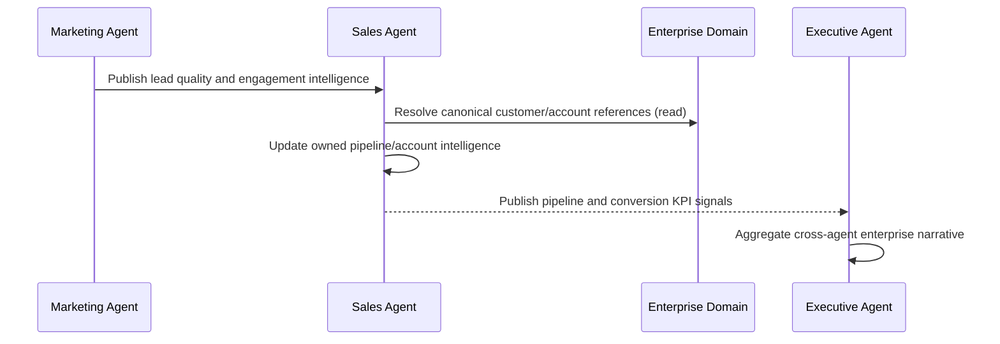
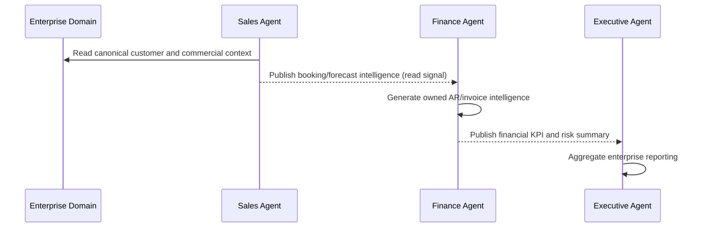
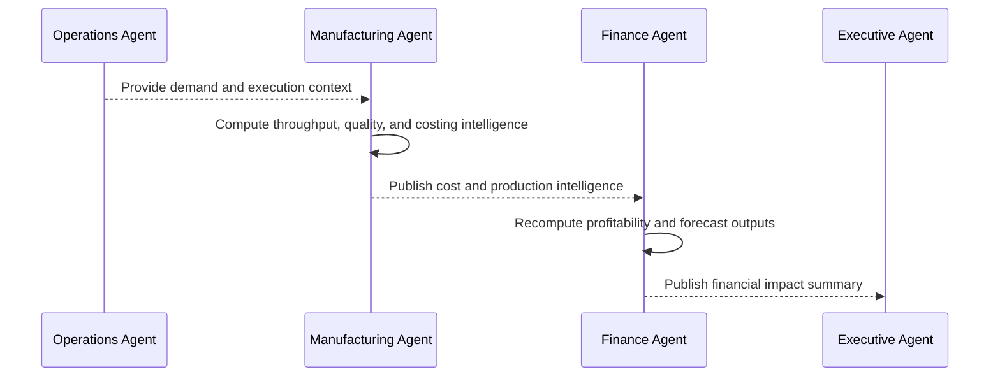
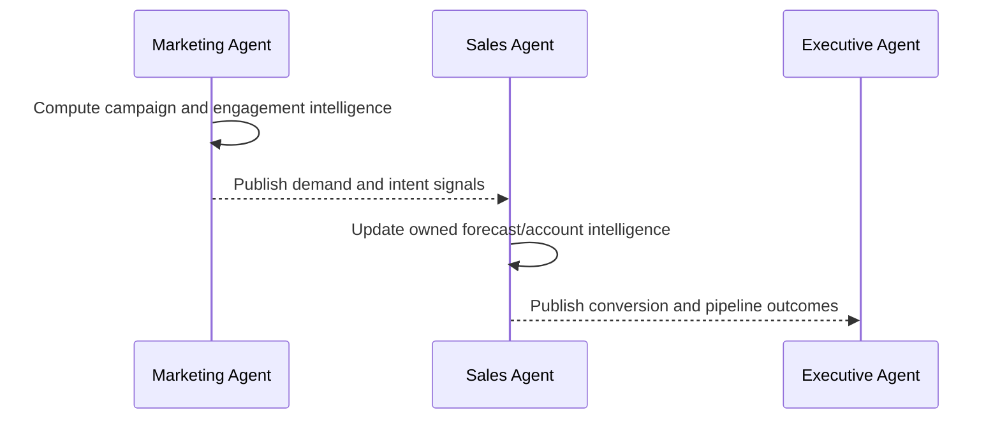
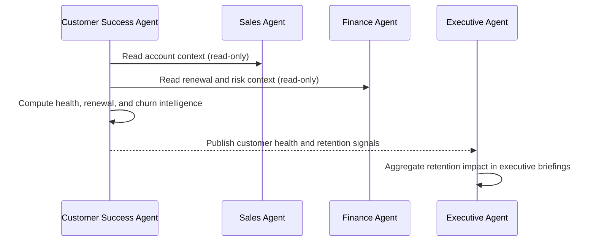
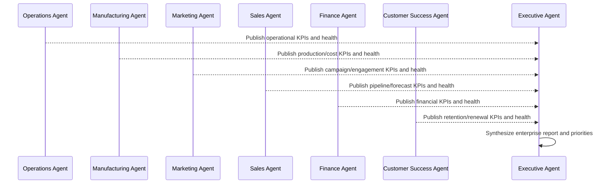

# Genesis Business Agent Sequence Diagrams

## 1) Lead -> Customer


## 2) Customer -> Invoice


## 3) Manufacturing -> Finance


## 4) Marketing -> Sales


## 5) Customer Success -> Executive


## 6) Recommendation Generation
```mermaid
sequenceDiagram
  participant A as Owning Business Agent
  participant R as Runtime
  participant X as Consumer Agent
  participant E as Executive Agent

  A->>R: Generate owned recommendation and lineage
  R->>A: Persist recommendation in owner repository
  A-->>X: Publish recommendation summary event
  A-->>E: Publish recommendation summary event
  Note over X,E: Consumption is read-only; no external mutation allowed
```

## 7) Executive Reporting

