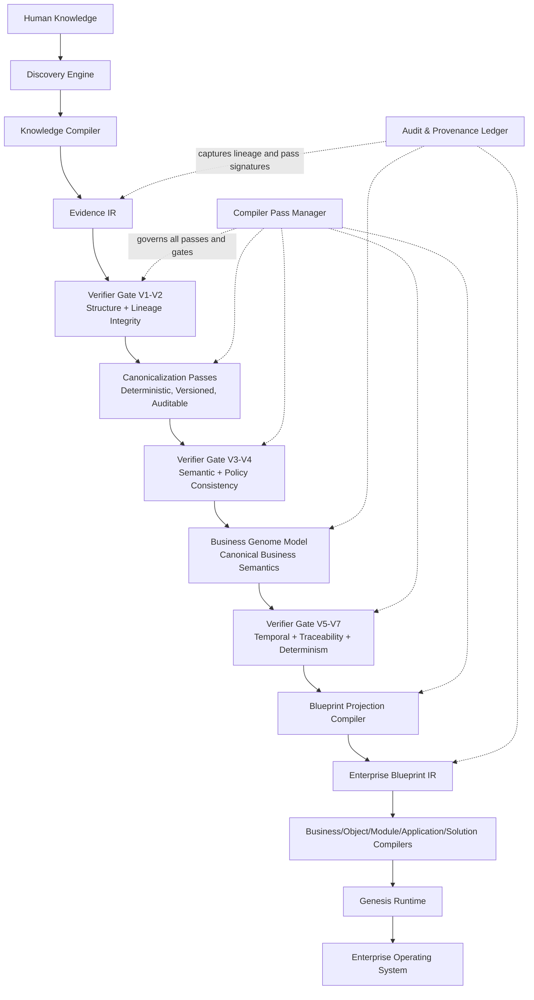

# ARD-0001: Business Genome Intermediate Representation (Business Genome IR)

**Status:** APPROVED WITH AMENDMENTS  
**Date:** 2026-07-09  
**Authority:** Genesis Architecture Review Board  
**Authoring Role:** Independent Senior Enterprise Systems and Compiler Architecture Advisor

---

## Executive Decision

The Board approves ARD-0001 with amendments. Genesis adopts a layered multi-IR compiler architecture with deterministic, auditable compiler governance.

This package is the Board-ready final record for ARD-0001 and supersedes draft review material for decision purposes.

---

## Approved With Amendments

### Approved

1. Genesis uses a layered multi-IR compiler architecture.
2. Canonical IR set:
   1. Evidence IR
   2. Business Genome IR
   3. Enterprise Blueprint IR
3. Evidence IR owns uncertainty, confidence, observations, hypotheses, validation state, and immutable evidence.
4. Business Genome IR represents canonical business semantics only.
5. Enterprise Blueprint IR represents enterprise architecture for downstream compilers.
6. Business Genome IR is independent of runtime, persistence, APIs, storage, networking, UI, and frameworks.
7. Every compiler pass is deterministic, versioned, auditable, and validated.
8. Compiler Pass Manager is mandatory with verifier gates between transformation stages.
9. Observation and Hypothesis remain lifecycle states within Evidence IR, not separate IRs.

### Amendments Incorporated

1. Canonical stage naming is normalized from "Business Genome IR" to **Business Genome Model** at the architecture communication layer while preserving the canonical contract semantics from prior phases.
2. Verifier gate grouping is fixed to three mandatory boundaries:
   1. V1-V2 after Evidence IR
   2. V3-V4 before Business Genome Model publication
   3. V5-V7 before Blueprint projection output admission
3. Audit and provenance capture is made explicit as a cross-cutting ledger attached to Evidence IR, Business Genome Model, and Enterprise Blueprint IR.

---

## ARD-0001 Executive Architecture Diagram

---

## Final Architecture Package (Normative)

### 1) Architecture Review Outcome

1. Single-IR strategy is rejected for long-horizon architecture fitness.
2. Layered IR architecture is accepted as the stable abstraction for deterministic enterprise compilation.
3. Business Genome Model is the canonical semantic contract between Evidence IR and Enterprise Blueprint IR projection.

### 2) Canonical Representation Boundaries

1. **Evidence IR:** epistemic truth and evidence lifecycle.
2. **Business Genome Model:** canonical enterprise semantics and constraints.
3. **Enterprise Blueprint IR:** architecture planning model for downstream compilers.

### 3) Compiler Governance

1. All passes are versioned and signed.
2. Pass order is deterministic and policy-governed.
3. Mandatory verifier gates enforce hard-stop admission rules.
4. Diagnostics and provenance are first-class contract artifacts.

---

## Business Genome Model Specification Baseline

### Required Node Capabilities

Every node in the Business Genome Model must support:

1. Identity
2. Name
3. Description
4. Metadata
5. Relationships
6. Evidence references
7. Confidence attestation reference
8. Validation status
9. Lifecycle
10. Version
11. Discovery source references
12. Compiler metadata
13. Traceability chain

### Mandatory Representable Domains

1. Organizations
2. Departments
3. Capabilities
4. Business Objects
5. Relationships
6. Business Rules
7. Policies
8. Decision Rules
9. Workflows
10. State Machines
11. Events
12. Commands
13. Queries
14. Roles
15. Permissions
16. Knowledge Holders
17. Responsibilities
18. Reports
19. KPIs
20. Connectors
21. External Systems
22. Automation
23. AI Agents
24. Evidence references
25. Metadata
26. Versioning and compiler metadata

### Canonical Invariants

1. Every canonical assertion links to evidence references.
2. Relationship endpoints must resolve within the same declared version context.
3. No runtime or storage concerns are allowed in canonical semantics.
4. Canonical output must be reproducible for equivalent canonical input sets.
5. Any semantic change requires version increment and traceability update.

---

## Canonical Contracts (Board Baseline)

### Contract Families

1. Structural contract
2. Semantic contract
3. Compiler pass contract
4. Validation contract
5. Serialization contract
6. Extension contract
7. Versioning and evolution contract

### Required Contract Artifacts

1. TypeScript contract declarations (contract artifacts only)
2. YAML schema profile for human authoring and review
3. JSON schema profile for machine validation
4. Verifier gate conformance specification
5. Compiler diagnostics and provenance envelope specification

### Gate Sequence (Mandatory)

1. V1 structural schema validity
2. V2 lineage and referential integrity
3. V3 semantic invariants
4. V4 policy and rule consistency
5. V5 temporal and lifecycle consistency
6. V6 traceability completeness
7. V7 determinism and hash reproducibility

---

## Implementation Roadmap (Architecture-Level)

### Milestones

1. M1 governance and contract foundation
2. M2 Business Genome Model meta-model freeze candidate
3. M3 canonical contract suite baseline
4. M4 pass manager and verifier architecture baseline
5. M5 reference corpus and simulation harness specification
6. M6 pre-implementation architectural proof gate
7. M7 implementation planning authorization

### Promotion Rule

Implementation planning cannot begin before M6 proof gate passes or explicit Board waiver is recorded with compensating controls.

---

## Validation Strategy (Pre-Implementation Proof)

### Required Proof Categories

1. Semantic correctness proof
2. Deterministic compilation proof
3. Traceability completeness proof
4. Constraint integrity proof
5. Evolution resilience proof
6. Multi-tenant and multi-industry extension proof
7. Simulation readiness proof

### Minimum Acceptance Conditions

1. All hard-stop gates pass.
2. No unresolved critical architecture risks.
3. Compatibility and migration obligations are defined for all breaking changes.
4. Proof artifacts are signed and archived by Board policy.

---

## Risk Register (Residual, Post-Approval)

1. Policy formalization complexity in heavily regulated industries.
2. Extension governance bottlenecks during major version transitions.
3. Potential under-specification of temporal semantics for simulation workloads.
4. Industry ontology drift pressure on canonical core.

Mitigation policy: all residual risks require assigned owner, measurable control, and review date before implementation authorization.

---

## Human Approval Required (Post-Amendment Checkpoints)

1. Ratify Business Genome Model naming and scope language for all future ADRs.
2. Ratify numeric thresholds for proof corpus coverage and simulation scenario coverage.
3. Ratify waiver policy for temporal validation exceptions.
4. Ratify long-term retention requirements for superseded contract artifacts.

---

## Final Board Motion Text

"ARD-0001 is approved with amendments. Genesis adopts the layered Evidence IR -> Business Genome Model -> Enterprise Blueprint IR architecture, governed by deterministic compiler passes, mandatory verifier gates, and auditable provenance. Implementation planning is authorized only after successful pre-implementation architectural proof per the ARD-0001 validation strategy."

---

## Traceability

1. ARD-0001 Part A: Architecture review, alternatives, ADR decision framing.
2. ARD-0001 Part B: Business Genome specification, contracts, roadmap, validation strategy.
3. This final package: ratified consolidation with Board-approved amendments.
