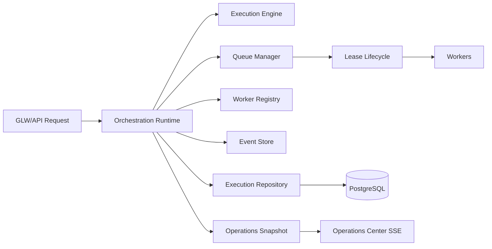

# GOP v1.0 Architecture Summary

## Runtime Topology

## Core Components

- Execution Engine: deterministic transitions, retry lineage, timing model.
- Queue Manager: priority queue, lease acquisition/renew/release, retry/dead-letter paths.
- Worker Registry: worker identity, capability/capacity state, health lifecycle.
- Event Store: durable ordered event stream and replay support.
- Execution Repository: durable execution/snapshot storage and recovery reads.
- Operations Center: live and durable runtime state projection.

## Design Character

- Additive evolution from GOP-0004A constitutional baseline.
- Deterministic dispatch order and conservative failure recovery.
- Workspace and policy boundaries preserved across control/data planes.
