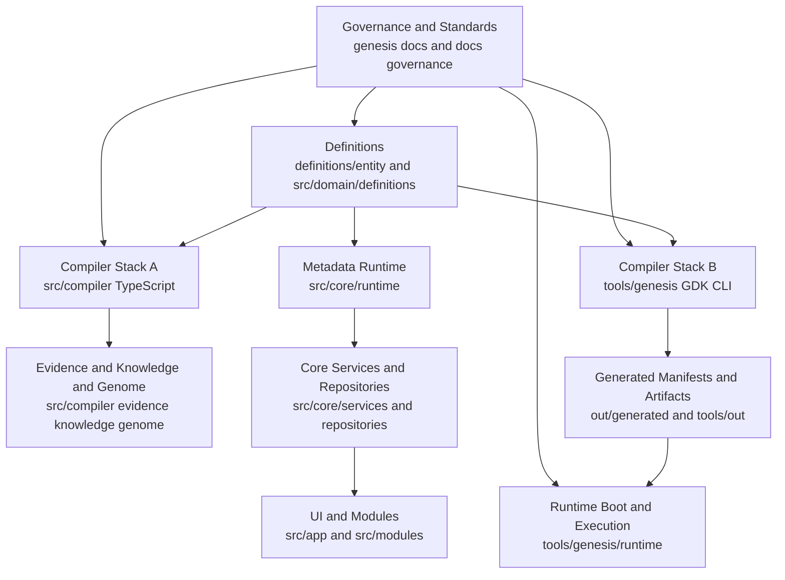
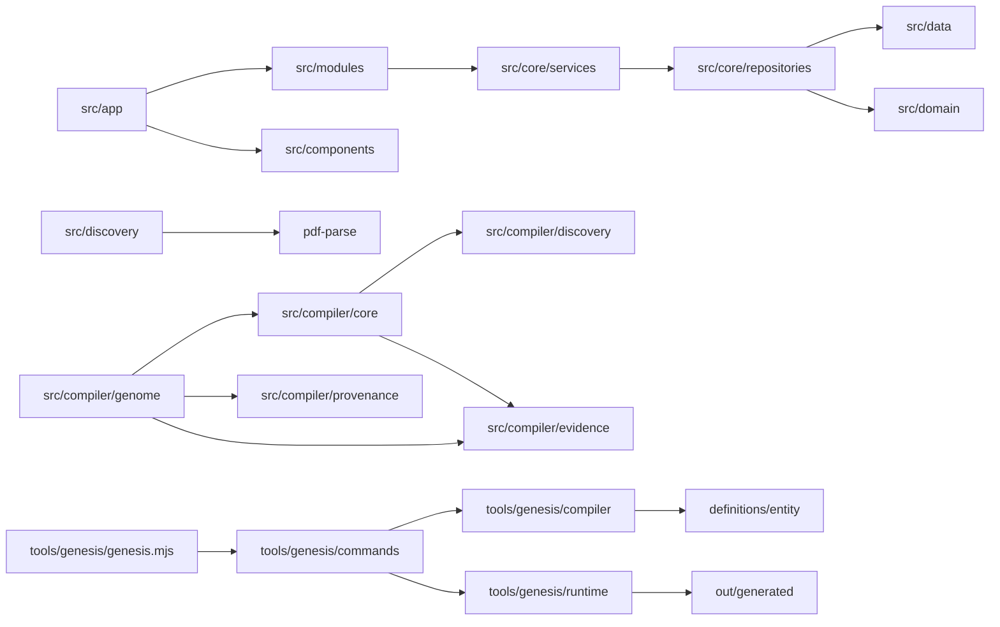

# Genesis Dependency Map

Status: Architectural recovery dependency map
Date: 2026-07-21
Method: Static evidence mapping from repository source and architecture docs.

## 1) Top-Level Architecture Dependency Graph

Evidence:
- [genesis/architecture/LAYERS.md](../architecture/LAYERS.md)
- [genesis/architecture/SPECIFICATION_MAP.md](../architecture/SPECIFICATION_MAP.md)
- [src/compiler/index.ts](../../src/compiler/index.ts)
- [tools/genesis/genesis.mjs](../../tools/genesis/genesis.mjs)
- [tools/genesis/runtime/RuntimeBootPipeline.mjs](../../tools/genesis/runtime/RuntimeBootPipeline.mjs)
- [src/core/runtime/MetadataRuntime.ts](../../src/core/runtime/MetadataRuntime.ts)

## 2) Implementation Relationship Graph (Current Checkout)

Evidence:
- [src/app/page.tsx](../../src/app/page.tsx)
- [src/modules/mission-control/ExecutiveBriefing.tsx](../../src/modules/mission-control/ExecutiveBriefing.tsx)
- [src/core/services/DashboardService.ts](../../src/core/services/DashboardService.ts)
- [src/core/repositories/CompanyRepository.ts](../../src/core/repositories/CompanyRepository.ts)
- [src/compiler/core/CompilerCore.ts](../../src/compiler/core/CompilerCore.ts)
- [src/compiler/genome/BusinessGenomeCompiler.ts](../../src/compiler/genome/BusinessGenomeCompiler.ts)
- [tools/genesis/commands/compile.mjs](../../tools/genesis/commands/compile.mjs)

## 3) Module Relationship Details

### Web and App Layer

1. [src/app](../../src/app) consumes module and component surfaces.
2. [src/modules](../../src/modules) consumes service/repository summaries.
3. [src/app](../../src/app) currently has no API route handlers in checkout.

### Compiler Layer (TypeScript)

1. [src/compiler/core](../../src/compiler/core) orchestrates pass execution.
2. [src/compiler/discovery](../../src/compiler/discovery) plugin registry supports source-type dispatch.
3. [src/compiler/evidence](../../src/compiler/evidence), [src/compiler/knowledge](../../src/compiler/knowledge), and [src/compiler/genome](../../src/compiler/genome) form staged semantic pipeline.

### CLI Compiler and Runtime Layer (tools)

1. [tools/genesis/genesis.mjs](../../tools/genesis/genesis.mjs) exposes multi-command orchestration surface.
2. [tools/genesis/compiler](../../tools/genesis/compiler) contains planner, pipeline, renderers, and writers.
3. [tools/genesis/runtime](../../tools/genesis/runtime) contains boot and execution engine contracts.

## 4) Runtime Relationships

### Runtime A (TypeScript Metadata Runtime)

Flow:
- Definition input -> loader -> validator -> registered summary

Evidence:
- [src/core/runtime/MetadataRuntime.ts](../../src/core/runtime/MetadataRuntime.ts)

### Runtime B (GDK Runtime Boot/Execution)

Flow:
- Generated manifests -> 12-stage boot pipeline -> runtime-boot-manifest -> execution validator/engine

Evidence:
- [tools/genesis/runtime/RuntimeBootPipeline.mjs](../../tools/genesis/runtime/RuntimeBootPipeline.mjs)
- [tools/genesis/runtime/RuntimeExecutionEngine.mjs](../../tools/genesis/runtime/RuntimeExecutionEngine.mjs)
- [GENESIS_RUNTIME_BOOT_V1_ARCHITECTURE.md](../../GENESIS_RUNTIME_BOOT_V1_ARCHITECTURE.md)

## 5) Cross-Module Dependencies

1. Dual definition sources:
   - [definitions/entity](../../definitions/entity)
   - [src/domain/definitions](../../src/domain/definitions)

2. Dual compiler stacks:
   - [src/compiler](../../src/compiler)
   - [tools/genesis/compiler](../../tools/genesis/compiler)

3. Dual pass registry implementations:
   - [src/compiler/core/CompilerPassRegistry.ts](../../src/compiler/core/CompilerPassRegistry.ts)
   - [tools/genesis/compiler/pipeline/CompilerPassRegistry.mjs](../../tools/genesis/compiler/pipeline/CompilerPassRegistry.mjs)

4. Dual knowledge compiler implementations:
   - [src/compiler/knowledge/KnowledgeCompiler.ts](../../src/compiler/knowledge/KnowledgeCompiler.ts)
   - [tools/genesis/compiler/KnowledgeCompiler.mjs](../../tools/genesis/compiler/KnowledgeCompiler.mjs)

## 6) Circular Dependency Assessment

Confirmed circular imports:
- None explicitly confirmed in this pass.

Authoritative dependency direction:
1. Architectural dependency direction and prohibited patterns are governed by ADR-0005 Constitutional Dependency Direction.
2. Runtime dependency authority follows approved two-plane boundaries in ADR-0004 Runtime Boundaries.
3. Compiler dual-surface authority follows approved boundaries in ADR-0001 Compiler Architecture.

Supersession note:
1. Earlier conceptual-loop and dual-surface ambiguity statements are historical context from pre-approval state and are superseded by approved ADR-0001, ADR-0004, and ADR-0005.

Evidence:
- [genesis/architecture/SPECIFICATION_MAP.md](../architecture/SPECIFICATION_MAP.md)
- [docs/architecture/0014-genesis-compilation-pipeline.md](../../docs/architecture/0014-genesis-compilation-pipeline.md)
- [src/compiler/index.ts](../../src/compiler/index.ts)
- [tools/genesis/genesis.mjs](../../tools/genesis/genesis.mjs)

## 7) Potential Dependency Violations

1. Specification-to-implementation mismatch:
   - Runtime/API capabilities heavily documented in [docs/architecture](../../docs/architecture) but no current [src/app/api](../../src/app) implementation exists in checkout.

2. Canonical source control:
   - Definition surfaces remain dual-source by approved design and are governed by ADR-0002 import-direction and synchronization rules.

3. Runtime boundary drift risk:
   - Runtime abstractions in [src/core/kernel](../../src/core/kernel) and [src/core/registry](../../src/core/registry) are stubs while runtime behavior exists primarily in tools runtime stack.

## 8) Dependency Confidence Levels

High confidence:
1. UI -> services/repositories/data chain.
2. Compiler core -> discovery/evidence/genome chain.
3. CLI -> commands -> compiler/runtime chain.

Medium confidence:
1. Full end-to-end production runtime alignment across src and tools stacks.

Low confidence:
1. Historical API route existence and migration intent, because current checkout lacks those files.
