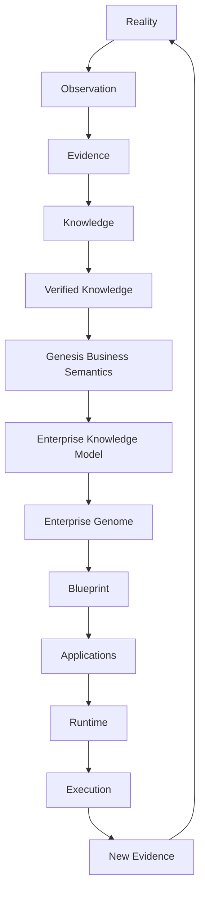

# GRA 1.0 - Genesis Reference Architecture

Status: Approved
Classification: Genesis Standard
Type: Canonical Reference Architecture

## 1. Purpose

GRA 1.0 defines the canonical conceptual architecture of Genesis.
It establishes how enterprise reality is observed, validated, structured, compiled, executed, and continuously re-observed as a living system.

## 2. Scope

GRA 1.0 covers:
- conceptual architecture layers and responsibilities
- enterprise knowledge pipeline
- compiler pipeline positioning
- enterprise genome positioning
- blueprint projection and runtime context
- feedback and learning loops

GRA 1.0 does not define implementation details, runtime mechanics, or code-generation internals.

## 3. Genesis Philosophy

Genesis treats software as a projection of validated enterprise reality.
Canonical meaning is governed by evidence, verification, and lineage.
Generation is downstream of truth-seeking, not upstream of it.

## 4. Architecture Principles

- Reality-first modeling over application-first modeling.
- Evidence before canonical promotion.
- Verification before generation.
- Deterministic transformations for reproducibility.
- Lineage preservation across all knowledge transitions.
- Clear separation between research, standards, and implementation.
- Continuous learning through execution feedback.

## 5. Layered Architecture

Genesis is structured as eight layers:
1. Reality
2. Research
3. Standards
4. Compiler
5. Enterprise Genome
6. Blueprint
7. Runtime
8. Living Enterprise

Detailed layer responsibilities are specified in LAYERS.md.

## 6. Enterprise Knowledge Pipeline

Enterprise understanding progresses through ordered transformations:
- observation and capture
- evidence formation
- knowledge claim construction
- verification and confidence qualification
- semantic alignment
- genome compilation
- blueprint projection
- runtime execution and outcome feedback

Detailed transformation controls are specified in KNOWLEDGE_FLOW.md.

## 7. Compiler Pipeline

The compiler pipeline operationalizes approved standards through deterministic stages.
Conceptually, it transforms evidence-grounded representations into progressively validated structures while preserving lineage.
Compiler stages consume standards and emit auditable artifacts that can be projected as blueprints.

## 8. Enterprise Genome

The Enterprise Genome is the structured, validated representation of enterprise identity, capabilities, relationships, policies, and evolution history.
It acts as the canonical structural substrate for projection.
It is not a user interface and not a deployment artifact by itself.

## 9. Blueprint Projection

Blueprints are implementation-oriented projections derived from validated genome state.
A blueprint is constrained by standards and lineage, and may be materialized into applications and operating surfaces.
Blueprints are projections, not sources of truth.

## 10. Runtime

Runtime executes projected applications against real enterprise operations.
It produces events, outcomes, and traces that become new observations.
Runtime is governed by upstream standards and does not redefine canonical semantics.

## 11. Living Enterprise Loop

Genesis is a continuous learning loop.
Execution outcomes generate new observations that return to research and evidence pipelines, allowing controlled adaptation over time.

## 12. Future Extension Points

Future architecture extensions may include:
- additional domain extension layers under standards governance
- richer compiler validation stages with proof obligations
- advanced genome integrity and continuity models
- expanded runtime feedback models for adaptive governance

All extensions must preserve core invariants: determinism, lineage, verification, and constitutional compliance.

## Conceptual Architecture Diagram

This architecture is a continuous learning system.
Each pass through the loop strengthens or challenges existing knowledge through evidence, verification, and governed promotion.
