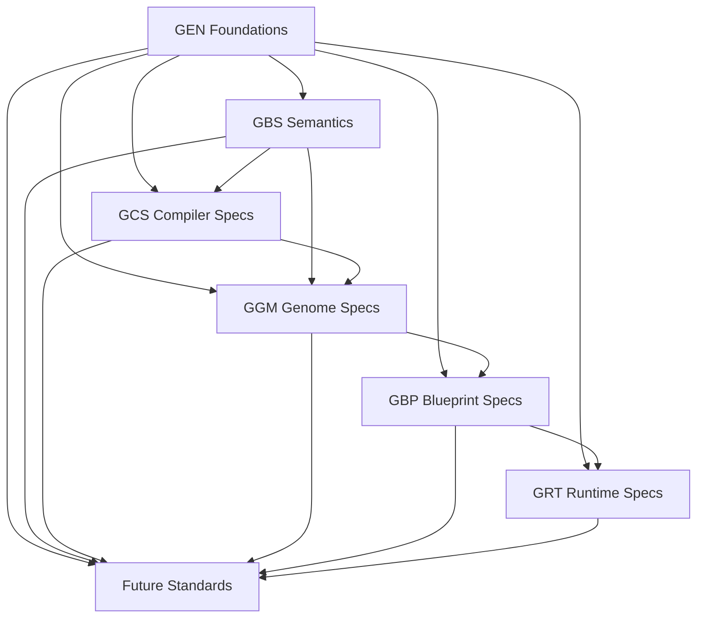

# Specification Map

Status: Approved
Classification: Genesis Standard
Type: Specification Dependency Model

## Purpose

This map shows dependencies among Genesis specifications.
It describes specification relationships, not implementation dependencies.

## Specification Families

- GEN: Genesis constitutional, governance, and architectural standards
- GBS: Genesis Business Semantics standards
- GCS: Genesis Compiler Specifications
- GGM: Genesis Genome Model specifications
- GBP: Genesis Blueprint Projection specifications
- GRT: Genesis Runtime specifications
- Future standards: approved extensions and domain-specific specification families

## Dependency Graph

## Dependency Notes

- GEN is foundational and constrains all downstream specification families.
- GBS defines canonical semantics consumed by GCS and GGM.
- GCS defines transformation constraints that feed GGM structures.
- GGM defines canonical enterprise model structures projected by GBP.
- GBP defines projection contracts consumed by GRT.
- Future standards must declare explicit parent dependencies and may not violate upstream invariants.

## Governance Rule

No downstream specification may redefine upstream canonical meaning.
Conflicts require governance review and formal standards revision.
