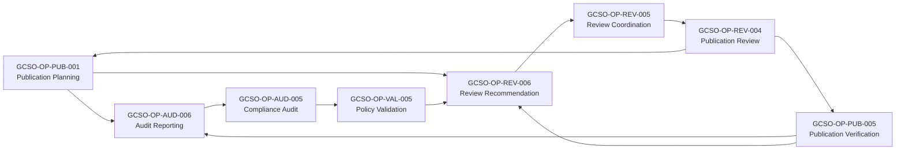

# GACR-0001 - Behavioral Dependency Cycle Resolution

## 1. Record Identity

- Record ID: GACR-0001
- Title: Behavioral Dependency Cycle Resolution
- Status: CLOSED
- Classification: Architectural Correction Record
- Record Type: Constitutional Governance Artifact
- Created: 2026-07-21
- Discovery Source: GCSOG-0001 Constitutional Operation Dependency Graph validation
- Owning Authority: Constitutional Governance

## 2. Purpose

This record formally captures a source contract modeling defect discovered through constitutional dependency graph validation and defines the approved architectural correction path.

This record does not modify architecture directly.
This record governs the correction process for affected source artifacts.

## 3. Scope

In scope:
- behavioral cycle finding derived from declared operation dependencies in GCSOCON-0001
- constitutional analysis of cycle-forming dependencies
- approved correction definition for affected dependency declarations
- regeneration and validation requirements

Out of scope:
- capability model restructuring
- operation identifier changes
- ownership changes
- implementation semantics

## 4. Governing Authorities

- GCR-1.0 (frozen baseline authority)
- AFR-0007 (frozen baseline authority)
- GCCR-0001 (frozen baseline authority)
- GCSA-0001 (service architecture authority)
- GCSA-0002 and GSCM-0001 (capability authority)
- GCSO-0001 (operation doctrine authority)
- GAR-0044 (approval gate for GCSA-0003)

## 5. Discovery Context

The defect was discovered during completion validation of GCSOG-0001, which was generated strictly from declared dependencies in GCSOCON-0001.

Generation constraints were preserved:
- no inferred dependencies
- no inferred sequencing
- no inferred authority
- no inferred execution order

Therefore, the detected behavioral cycle is a source contract modeling defect, not a graph defect.

## 6. Finding Summary

- Finding ID: GACR-0001-F01
- Finding Type: Blocking Behavioral Dependency Cycle
- Severity: Blocking
- Source Artifact Class: Operation Contracts
- Discovery Artifact: GCSOG-0001
- Affected Cycle Component: GCSO-OP-AUD-005, GCSO-OP-AUD-006, GCSO-OP-PUB-001, GCSO-OP-PUB-005, GCSO-OP-REV-004, GCSO-OP-REV-005, GCSO-OP-REV-006, GCSO-OP-VAL-005

## 7. Evidence

Complete cycle-forming dependency edges, exactly as declared and reflected in the derived graph:

| Source Operation ID | Source Operation Name | Target Operation ID | Target Operation Name | Dependency Type | Source Contract Reference |
|---|---|---|---|---|---|
| GCSO-OP-PUB-001 | Publication Planning Operation | GCSO-OP-AUD-006 | Audit Reporting Operation | Requires | GCSOCON-0001, GCSO-OP-PUB-001, Field 24 |
| GCSO-OP-PUB-001 | Publication Planning Operation | GCSO-OP-REV-006 | Review Recommendation Operation | Requires | GCSOCON-0001, GCSO-OP-PUB-001, Field 24 |
| GCSO-OP-REV-004 | Publication Review Operation | GCSO-OP-PUB-001 | Publication Planning Operation | Requires | GCSOCON-0001, GCSO-OP-REV-004, Field 24 |
| GCSO-OP-REV-004 | Publication Review Operation | GCSO-OP-PUB-005 | Publication Verification Operation | Requires | GCSOCON-0001, GCSO-OP-REV-004, Field 24 |
| GCSO-OP-PUB-005 | Publication Verification Operation | GCSO-OP-AUD-006 | Audit Reporting Operation | Requires | GCSOCON-0001, GCSO-OP-PUB-005, Field 24 |
| GCSO-OP-PUB-005 | Publication Verification Operation | GCSO-OP-REV-006 | Review Recommendation Operation | Requires | GCSOCON-0001, GCSO-OP-PUB-005, Field 24 |
| GCSO-OP-AUD-006 | Audit Reporting Operation | GCSO-OP-AUD-005 | Compliance Audit Operation | Requires | GCSOCON-0001, GCSO-OP-AUD-006, Field 24 |
| GCSO-OP-AUD-005 | Compliance Audit Operation | GCSO-OP-VAL-005 | Policy Validation Operation | Requires | GCSOCON-0001, GCSO-OP-AUD-005, Field 24 |
| GCSO-OP-VAL-005 | Policy Validation Operation | GCSO-OP-REV-006 | Review Recommendation Operation | Requires | GCSOCON-0001, GCSO-OP-VAL-005, Field 24 |
| GCSO-OP-REV-006 | Review Recommendation Operation | GCSO-OP-REV-005 | Review Coordination Operation | Requires | GCSOCON-0001, GCSO-OP-REV-006, Field 24 |
| GCSO-OP-REV-005 | Review Coordination Operation | GCSO-OP-REV-004 | Publication Review Operation | Requires | GCSOCON-0001, GCSO-OP-REV-005, Field 24 |

## 8. Source Artifact References

Authoritative source artifacts:
- genesis/constitutional-services/operations/contracts/GCSOCON-0001-Constitutional-Service-Operation-Contracts.md
- genesis/constitutional-services/operations/graphs/GCSOG-0001-Constitutional-Operation-Dependency-Graph.md
- genesis/constitutional-services/operations/GCSO-0001-Genesis-Constitutional-Service-Operation-Model.md
- genesis/constitutional-services/operations/catalogs/GCSOC-0001-Constitutional-Service-Operation-Catalog.md
- genesis/constitutional-services/operations/mappings/GCSOM-0001-Capability-to-Operation-Mapping.md

Primary discovery references in graph:
- Section 18 Behavioral Cycle Analysis
- Section 25 Machine-Verifiable Validation Summary
- Section 26 GAR-0044 Readiness Assessment

## 9. Behavioral Cycle Description

The blocking behavioral cycle is formed by mandatory Requires dependencies across publication, review, audit, and validation operations.

Closed cycle examples present in declared dependencies:
1. GCSO-OP-PUB-001 -> GCSO-OP-AUD-006 -> GCSO-OP-AUD-005 -> GCSO-OP-VAL-005 -> GCSO-OP-REV-006 -> GCSO-OP-REV-005 -> GCSO-OP-REV-004 -> GCSO-OP-PUB-001
2. GCSO-OP-REV-006 -> GCSO-OP-REV-005 -> GCSO-OP-REV-004 -> GCSO-OP-PUB-005 -> GCSO-OP-REV-006

## 10. Cycle Diagram

## 11. Dependency Analysis

Per-edge constitutional classification assessment:

| Edge | Current Classification | Assessment | Correct Modeling Decision |
|---|---|---|---|
| PUB-001 -> AUD-006 | Mandatory behavioral Requires | Aligns with publication readiness gating by audit context | Keep as behavioral Requires |
| PUB-001 -> REV-006 | Mandatory behavioral Requires | Aligns with publication readiness gating by review recommendation | Keep as behavioral Requires |
| REV-004 -> PUB-001 | Mandatory behavioral Requires | Creates backward mandatory dependency from review into planning that participates in blocking cycle | Reclassify as informational reference |
| REV-004 -> PUB-005 | Mandatory behavioral Requires | Creates backward mandatory dependency from review into verification that participates in blocking cycle | Reclassify as informational reference |
| PUB-005 -> AUD-006 | Mandatory behavioral Requires | Aligns with verification dependency on audit outcomes | Keep as behavioral Requires |
| PUB-005 -> REV-006 | Mandatory behavioral Requires | Aligns with verification dependency on review recommendation | Keep as behavioral Requires |
| AUD-006 -> AUD-005 | Mandatory behavioral Requires | Aligns with audit reporting aggregation of audit classes | Keep as behavioral Requires |
| AUD-005 -> VAL-005 | Mandatory behavioral Requires | Aligns with compliance assessment dependency on policy validation context | Keep as behavioral Requires |
| VAL-005 -> REV-006 | Mandatory behavioral Requires | Aligns with policy conformance dependency on review recommendation context | Keep as behavioral Requires |
| REV-006 -> REV-005 | Mandatory behavioral Requires | Aligns with recommendation dependency on coordinated reviews | Keep as behavioral Requires |
| REV-005 -> REV-004 | Mandatory behavioral Requires | Aligns with review coordination dependency on publication review outcome | Keep as behavioral Requires |

## 12. Constitutional Analysis

Constitutional principles applied:
- operations must remain acyclic for behavioral dependency semantics unless explicit cycle justification is present in source contracts
- source contract declarations are authoritative and must be corrected at source when defective
- implementation-independent semantics must be preserved

Evaluation outcome:
- no explicit cycle justification exists in the implicated contract entries
- the problematic links are the two mandatory dependencies in GCSO-OP-REV-004 field 24 that close loops back into publication operations already constrained by review recommendation
- those two dependencies are constitutionally consistent as informational context references, but not as mandatory behavioral Requires edges

## 13. Root Cause Analysis

Authoritative root cause:
- Erroneous mandatory dependency classification in GCSOCON-0001 for GCSO-OP-REV-004 field 24.

Specifically:
- Publication Planning (GCSO-OP-PUB-001) and Publication Verification (GCSO-OP-PUB-005) were modeled as mandatory behavioral dependencies of Publication Review.
- These dependencies should be modeled as informational references, not mandatory behavioral Requires dependencies.

This single classification defect is sufficient to create the blocking behavioral cycle component found in GCSOG-0001.

## 14. Architectural Impact Assessment

| Artifact | Impact Determination | Rationale |
|---|---|---|
| GCSO-0001 | No Impact | Operation doctrine remains valid; defect is in dependency declaration classification, not doctrine. |
| GCSOC-0001 | No Impact | Operation inventory is unchanged. |
| GCSOM-0001 | No Impact | Capability-to-operation mapping remains unchanged. |
| GCSOCON-0001 | Requires Revision | Source contract dependency declarations must be corrected. |
| GCSOG-0001 | Requires Regeneration | Graph must be regenerated from revised contracts. |
| GAR-0044 | Requires Review | Readiness decision depends on post-correction validation results. |

## 15. Alternatives Considered

1. Accept cycle with no correction
- Rejected: violates blocking-cycle governance and leaves unresolved finding.

2. Change graph derivation behavior to suppress cycle edges
- Rejected: would violate source-faithful graph generation constraints.

3. Reclassify multiple dependencies across multiple operations
- Rejected: unnecessary breadth beyond proven defect surface.

4. Minimal source correction on GCSO-OP-REV-004 dependency classification
- Accepted: directly addresses root cause with minimal constitutional change surface.

## 16. Recommended Resolution

Approved architectural correction:
- revise GCSOCON-0001 contract entry for GCSO-OP-REV-004
- reclassify two dependencies from mandatory behavioral to informational reference
- preserve all operation IDs, ownership, capability mappings, and constitutional authorities

No change is authorized to:
- capability model
- operation inventory
- ownership model
- identifier model
- constitutional authority model

## 17. Required Contract Revisions

Target artifact:
- genesis/constitutional-services/operations/contracts/GCSOCON-0001-Constitutional-Service-Operation-Contracts.md

Required operation contract modifications:
1. Operation GCSO-OP-REV-004, Field 24 Declared Dependencies
- Current: Publication Planning (GCSO-OP-PUB-001); Publication Verification.
- Revised: Remove both as mandatory behavioral dependencies.

2. Operation GCSO-OP-REV-004, Field 25 Permitted Compositions
- Current: mirrors field 24 mandatory composition list.
- Revised: remove composition binding to GCSO-OP-PUB-001 and GCSO-OP-PUB-005.

3. Operation GCSO-OP-REV-004 traceability context
- Revised treatment: publication planning and publication verification context may be retained as informational references only, outside mandatory dependency semantics.

Contracts requiring modification:
- GCSO-OP-REV-004 only.

## 18. Required Graph Regeneration

After source contract revision:
- regenerate GCSOG-0001 strictly from updated GCSOCON-0001 declared dependencies
- do not add inferred dependencies
- do not add inferred sequencing
- do not add inferred authority
- do not add inferred execution order

Expected graph edge changes:
- Remove edge: GCSO-OP-REV-004 -> GCSO-OP-PUB-001
- Remove edge: GCSO-OP-REV-004 -> GCSO-OP-PUB-005

No other edge additions or removals are authorized by this correction record.

## 19. Validation Criteria

Correction is not complete until regenerated graph reports:
- Behavioral Cycles: 0
- Authority Cycles: 0
- Lifecycle Cycles: 0
- Undefined Sources: 0
- Undefined Targets: 0
- Duplicate Edges: 0
- Self Dependencies: 0
- Unresolved Findings: 0

Additional conformance checks:
- operation count remains 60
- capability mappings unchanged
- ownership unchanged
- operation identifiers unchanged

## 20. Approval Requirements

Required approvals before closure:
- Constitutional Governance approval of GACR-0001 resolution
- Architecture authority review confirming correction scope integrity
- GAR-0044 approval of GCSA-0003 after post-correction validation

Implementation status for this record: correction implemented and ready for architectural review.

## 21. Implementation Sequence

1. Approve GACR-0001 while status remains OPEN.
2. Revise GCSOCON-0001 only in the identified GCSO-OP-REV-004 contract dependency fields.
3. Regenerate GCSOG-0001 from revised contracts.
4. Execute graph validation and confirm all criteria in Section 19.
5. Submit GAR-0044 review package with regenerated graph evidence.
6. Upon GAR-0044 approval and validation pass, mark GACR-0001 as CLOSED.

## 22. Closure Conditions

This record shall remain OPEN until all conditions are true:
1. GCSOCON-0001 has been revised.
2. GCSOG-0001 has been regenerated.
3. Graph validation passes.
4. GAR-0044 approves GCSA-0003.

Only then may GACR-0001 status be changed to CLOSED.

## 23. Future Prevention Guidance

To prevent recurrence:
- require cycle-screening review for all new Field 24 dependency declarations before approval
- require explicit classification review: behavioral Requires vs informational reference vs governance dependency
- require source-contract rationale whenever cross-service dependencies are marked mandatory
- require pre-approval simulation of dependency graph impact for contract updates

Governance pattern established by this record:

Discovery
    ↓
Finding
    ↓
Architectural Correction Record (GACR)
    ↓
Affected Artifact Revision
    ↓
Validation
    ↓
Closure

This lifecycle is the recommended constitutional governance pattern for future architectural defect remediation in Project Genesis.

## 24. Appendix

### A. Current Blocking Validation Snapshot

- Operations: 60
- Dependency Edges: 125
- Authority Cycles: 0
- Lifecycle Cycles: 0
- Behavioral Cycles: 1
- Reference Cycles: 1
- Undefined Sources: 0
- Undefined Targets: 0
- Duplicate Edges: 0
- Self Dependencies: 0
- Unresolved Findings: 1

### B. Correction Invariants

The correction shall preserve:
- capability model
- operation inventory
- ownership
- identifiers
- constitutional authority

Only dependency declarations are in correction scope for GACR-0001.

### C. Implementation Validation Evidence (2026-07-21)

Post-implementation graph validation results:
- Operations: 60
- Dependency Edges: 123
- Behavioral Cycles: 0
- Authority Cycles: 0
- Lifecycle Cycles: 0
- Reference Cycles: 1
- Undefined Sources: 0
- Undefined Targets: 0
- Duplicate Edges: 0
- Self Dependencies: 0
- Unresolved Findings: 0

Validation target assessment:
- Behavioral Cycles: PASS
- Authority Cycles: PASS
- Lifecycle Cycles: PASS
- Undefined Sources: PASS
- Undefined Targets: PASS
- Duplicate Edges: PASS
- Self Dependencies: PASS
- Unresolved Findings: PASS

Implementation conclusion:
- GACR-0001 correction objectives are satisfied.
- Correction is ready for architectural review.
