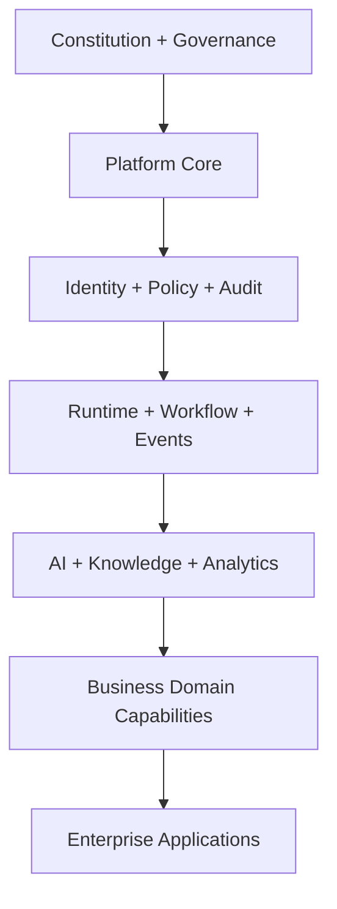
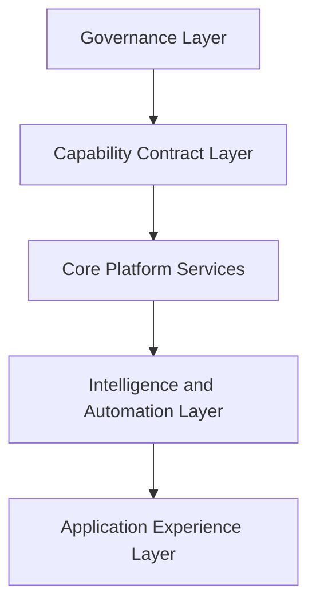
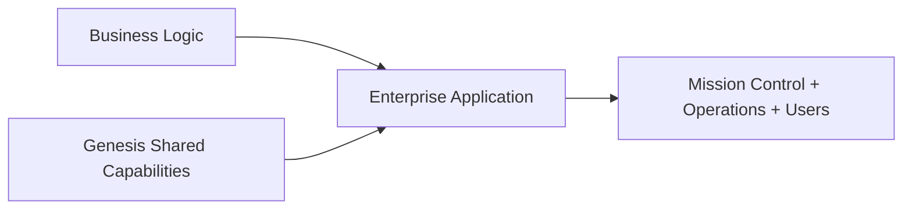
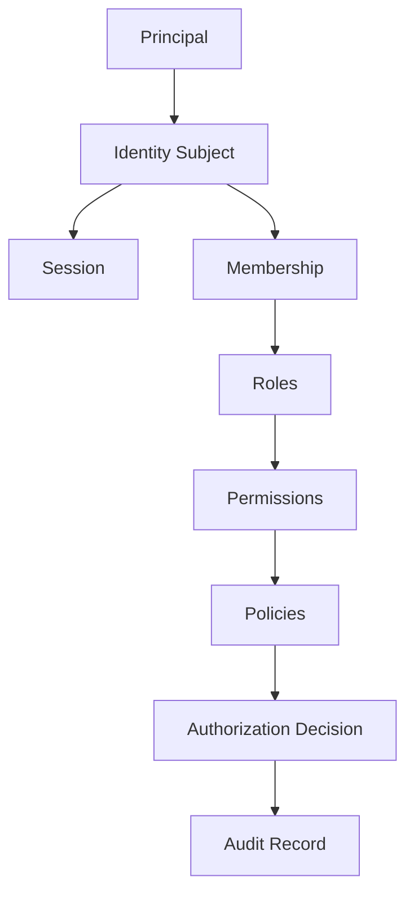
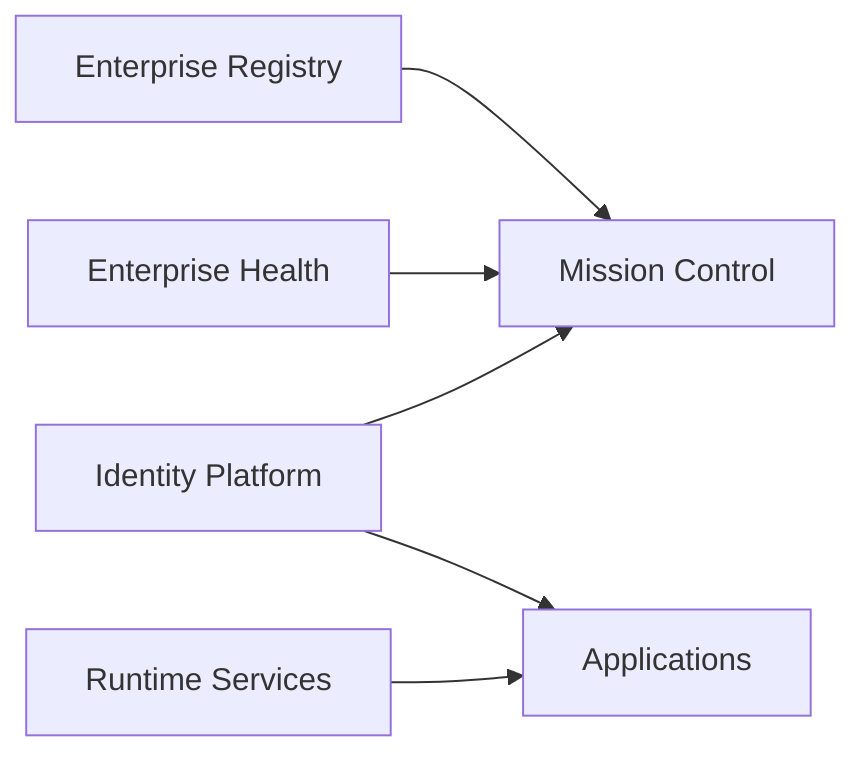
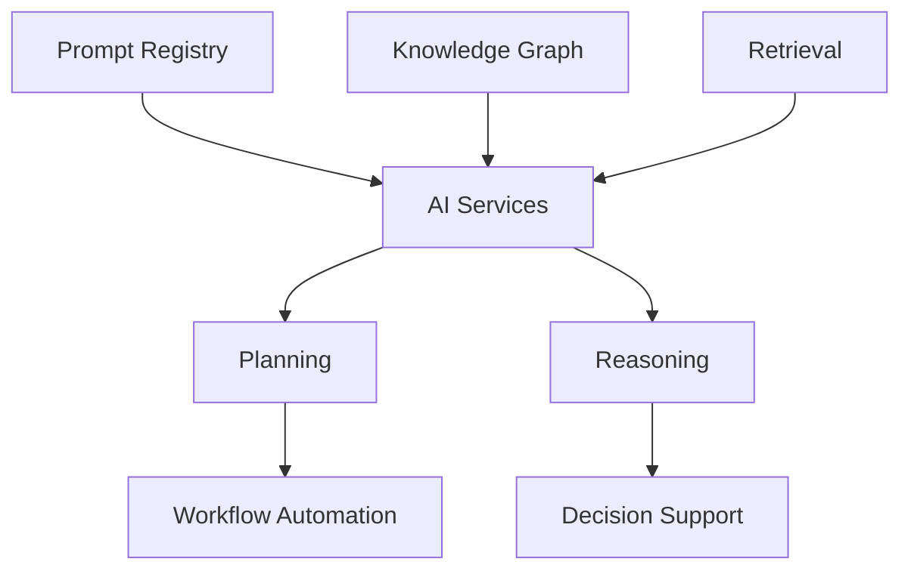
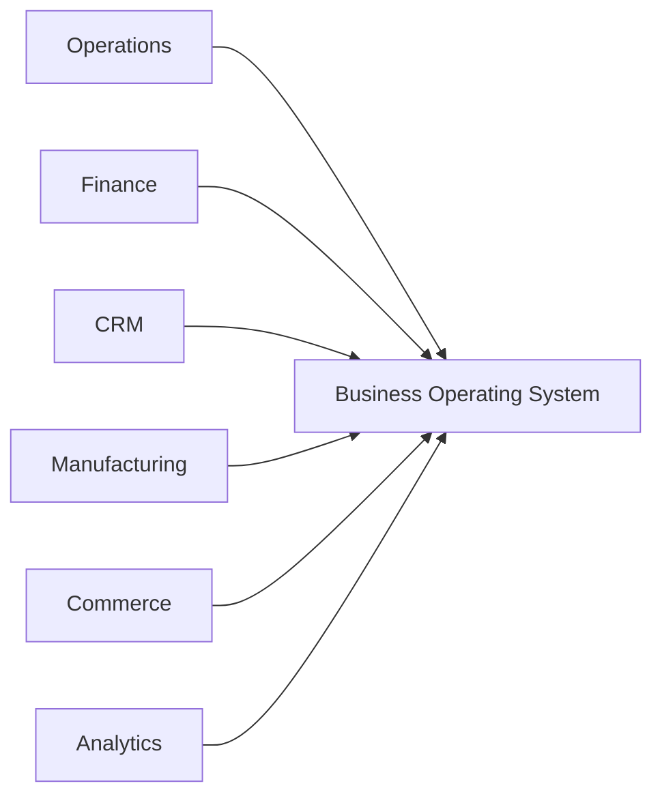
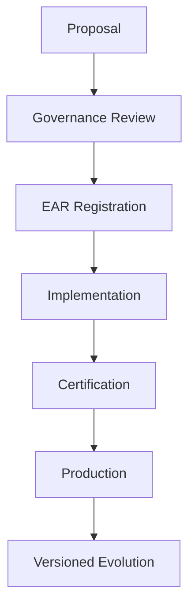
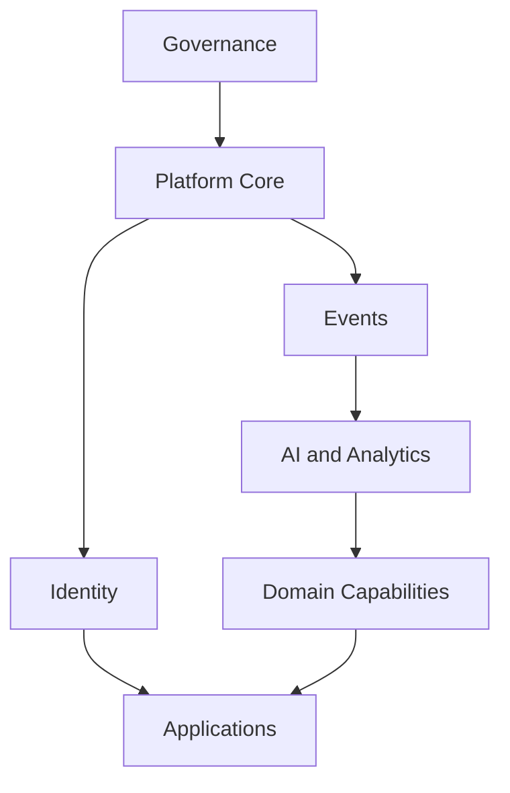
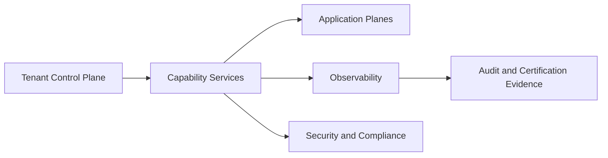

# 08 - Enterprise Architecture Diagrams

## Capability Stack

## Platform Layers

## Application Composition

## Identity Relationships

## Enterprise Services

## AI Platform

## Business Platform

## Application Lifecycle

## Capability Dependency Flow

## Long-Term Cloud Architecture

