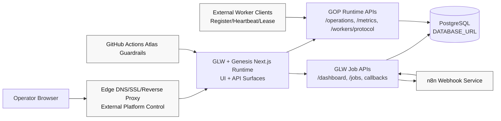

# GPC-0001A-01 Deployment Topology Diagram

Program: GPC-0001  
Work package: GPC-0001A-01  
Date: 2026-07-29

## As-Is Deployment Topology

## Evidence Anchors

1. Runtime command model: package.json:7, package.json:8
2. GLW API routes: src/app/api/glw/jobs/page/route.ts:4, src/app/api/glw/jobs/callback/route.ts:4
3. GOP runtime routes: src/app/api/gop/operations/route.ts:4, src/app/api/gop/metrics/route.ts:4
4. Shared DB dependency: src/lib/glw/prisma.ts:10, src/platform/gop/runtime/prisma.ts:10
5. Webhook integration: src/lib/glw/n8n.ts:181, src/lib/glw/n8n.ts:96
6. Worker protocol behavior: src/platform/gop/runtime/worker-registry.ts:13
7. CI validation path: .github/workflows/atlas-guardrails.yml:1
