# Genesis Commerce Document Architecture Diagram

## Structural View

```mermaid
flowchart TD
  A[GenesisCommerceDocument Base Framework]

  A --> B[Identity and Numbering Contracts]
  A --> C[Lifecycle and Status Contracts]
  A --> D[Revision and Version Contracts]
  A --> E[Parties and Addresses Contracts]
  A --> F[Line Collection Contracts]
  A --> G[Totals and Commercial Envelope]
  A --> H[Attachment and Notes Contracts]
  A --> I[Metadata and Audit Contracts]
  A --> J[Approval and Export Hooks]

  A --> Q[Quote]
  A --> SO[Sales Order]
  A --> PO[Purchase Order]
  A --> RA[Rental Agreement]
  A --> SVO[Service Order]
  A --> WO[Work Order]
  A --> INV[Invoice]
  A --> CM[Credit Memo]
  A --> RMA[Return Authorization]

  Q --> QL[Pricing, Expiration, Negotiation, Conversion]
  SO --> SOL[Fulfillment and Shipping Behavior]
  PO --> POL[Vendor and Procurement Behavior]
  RA --> RAL[Rental Lifecycle Behavior]
  SVO --> SVOL[Service Behavior]
  WO --> WOL[Execution Behavior]
  INV --> INVL[Posting and Payment Behavior]
  CM --> CML[Credit Reversal Behavior]
  RMA --> RMAL[Return Acceptance Behavior]

  K[Reference Domains] --> A
  K1[Customers] --> K
  K2[Products] --> K
  K3[Inventory] --> K
  K4[Sites] --> K
  K5[Integration Profiles] --> K
  K6[Business Genome Entities] --> K
  K7[Marketing Entities] --> K
```

## Boundary View

## Decision
APPROVED. Framework is suitable as canonical base for future transactional document specializations.
