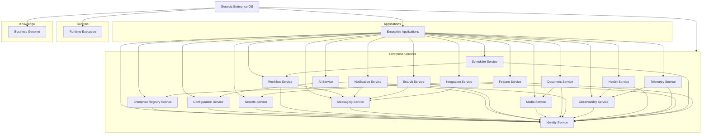

# Genesis Enterprise Service Diagram

## Diagram

## Interpretation
- Applications consume services; services remain application independent.
- Service dependencies remain inside the service layer and avoid cycles.
- Runtime and Business Genome keep their own constitutional boundaries.
