# Genesis Branch Convergence Report

## Executive Summary
RB-004 execution completed as a governance-first convergence package.

No unauthorized merge or rebase operations were performed.
Convergence evidence was collected for release-critical branches, merge readiness was classified, dependency order was established, and governance-level branch inconsistencies were documented.

Current result: convergence planning and readiness verification are complete; merge execution remains blocked by dependency sequencing and approvals.

## Branch Inventory Scope
- Repository: ssidisplaysai/platform
- Merge target: main
- Branches inspected: 11 release-critical candidate branches

## Release-Critical Branch Inventory
| Branch | Current HEAD Commit | Merge Target | Associated Package(s) | Certification Status | Governance Status | Release Status | Merge Readiness | Outstanding Conflicts | Outstanding Dependencies |
|---|---|---|---|---|---|---|---|---|---|
| feature/gcp-0002b-commerce-foundation | ba0c7a31aeaa1aba6851e7af7de414e4e3ece70f | main | GCP-0002B | Not Required For Version 1.0 certification gating | Lifecycle metadata complete | Candidate | WAITING FOR DEPENDENCY | None detected (merge-tree markers: 0) | PR missing; must be first in chain |
| feature/gcp-0002c-multi-site-foundation | 261e902ff135f735371e2eee5b88938fc3b1858e | main | GCP-0002C | Not Required For Version 1.0 certification gating | Lifecycle metadata complete | Candidate | WAITING FOR DEPENDENCY | None detected (merge-tree markers: 0) | Depends on gcp-0002b merge; PR missing |
| feature/gcp-0002d-product-catalog-foundation | 5f4b9ce8060c84403d0ad247279f6a5ea7d84a7c | main | GCP-0002D | Not Required For Version 1.0 certification gating | Lifecycle metadata complete | Candidate | WAITING FOR DEPENDENCY | None detected (merge-tree markers: 0) | Depends on gcp-0002c merge; PR missing |
| feature/gcp-0002e-inventory-foundation | d0c346f72954b14d854b68c884856e4996fd121a | main | GCP-0002E | Not Required For Version 1.0 certification gating | Lifecycle metadata complete | Candidate | WAITING FOR DEPENDENCY | None detected (merge-tree markers: 0) | Depends on gcp-0002d merge; PR missing |
| feature/gcp-0002f-integration-profiles | e343a183e3e15746a425df067ce70ab89c296ea9 | main | GCP-0002F | Not Required For Version 1.0 certification gating | Lifecycle metadata complete | Candidate | WAITING FOR DEPENDENCY | None detected (merge-tree markers: 0) | Depends on gcp-0002e merge; PR missing |
| feature/gcp-0002g-customer-account-foundation | 15f6dc9b2d5e245817b478d503fb923169dd6a6b | main | GCP-0002G | Not Required For Version 1.0 certification gating | Lifecycle metadata complete | Candidate | WAITING FOR DEPENDENCY | None detected (merge-tree markers: 0) | Depends on gcp-0002f merge; PR missing |
| feature/gcp-0002m1-foundation-audit | a3e1dd6acfdff8fadea3b3ca3714ca3be0905648 | main | GCP-0002M1 | Not Required For Version 1.0 certification gating | Lifecycle metadata complete | Candidate | WAITING FOR DEPENDENCY | None detected (merge-tree markers: 0) | Depends on gcp-0002g merge; PR missing |
| feature/gcp-0002m1-r1a-authorization-conformance | 407b30c5ec264b8dc3df3d5b3f3be1a0cc24f008 | main | GCP-0002M1-R1A lineage | Not Required For Version 1.0 certification gating | Lifecycle metadata lineage tracked via GCP-0002M1 path | Candidate | WAITING FOR DEPENDENCY | None detected (merge-tree markers: 0) | Depends on gcp-0002m1 merge; PR missing |
| feature/gcp-0002m1-r1b-durable-persistence | 29baf7fb8b4aa19981d5007f8aa449c0f8790ba7 | main | GRP-0001, GRP-0001A/B/C closeout docs plus GCP-0002M1-R1B lineage | Version 1.0 required certifications complete in branch evidence set | Governance records complete | Active release-governance branch | WAITING FOR APPROVAL | None detected (merge-tree markers: 0) | Open PR exists (#12) but PR head SHA is stale vs local HEAD; approval/revalidation required |
| feature/gar-0003-constitutional-assessment | 61af8cd07db9facfc4523f443562e130668aa5ba | main | GAR-0003 lineage | Assessment baseline package | Superseded by GRP governance chain | Historical | OUT OF VERSION 1.0 SCOPE | None detected | No release-critical convergence action required |
| foundation-v1.0 | aad6b516a68464f37e202f157018d257f83ae274 | main | Legacy release branch lineage | Mixed | Naming not aligned to release/x.y policy | Historical | OUT OF VERSION 1.0 SCOPE | None detected | Governance disposition required; excluded from canonical convergence path |

## Merge Dependency Graph

```mermaid
graph LR
  B[feature/gcp-0002b-commerce-foundation] --> C[feature/gcp-0002c-multi-site-foundation]
  C --> D[feature/gcp-0002d-product-catalog-foundation]
  D --> E[feature/gcp-0002e-inventory-foundation]
  E --> F[feature/gcp-0002f-integration-profiles]
  F --> G[feature/gcp-0002g-customer-account-foundation]
  G --> M1[feature/gcp-0002m1-foundation-audit]
  M1 --> R1A[feature/gcp-0002m1-r1a-authorization-conformance]
  R1A --> R1B[feature/gcp-0002m1-r1b-durable-persistence]
  R1B --> MAIN[main]
```

## Required Merge Order
1. feature/gcp-0002b-commerce-foundation
2. feature/gcp-0002c-multi-site-foundation
3. feature/gcp-0002d-product-catalog-foundation
4. feature/gcp-0002e-inventory-foundation
5. feature/gcp-0002f-integration-profiles
6. feature/gcp-0002g-customer-account-foundation
7. feature/gcp-0002m1-foundation-audit
8. feature/gcp-0002m1-r1a-authorization-conformance
9. feature/gcp-0002m1-r1b-durable-persistence

## Conflict Inventory
- Predicted merge conflicts detected via merge-tree markers: 0 across inspected release-critical branches.
- Convergence blockers are governance and approval sequencing, not merge-content conflicts.

## Approval Status
- Open PRs detected in inspected set: 1
- PR #12: branch feature/gcp-0002m1-r1b-durable-persistence -> main.
- Governance inconsistency: PR head SHA does not match local branch HEAD, requiring PR refresh/revalidation before approval.
- Remaining inspected branches: PRs not yet opened.

## Governance Inconsistencies
1. Missing required PRs for 8 dependency-chain branches.
2. Stale PR head reference for branch feature/gcp-0002m1-r1b-durable-persistence.
3. Release branch naming variance: release/business-genome-compiler-v1 and foundation-v1.0 do not conform to release/x.y naming policy.

## Convergence Readiness Score
- Score: 62/100

Scoring basis:
- Positive: no predicted merge conflicts, lifecycle metadata complete, clear dependency chain.
- Negative: PR coverage incomplete, approval path incomplete, stale PR head reference, and naming-policy variance.

## Promotion Impact
- RB-004 package execution provides auditable convergence plan and branch-level readiness classification.
- Version 1.0 promotion remains blocked until dependency-chain PR creation/approval and canonical convergence execution are completed.
