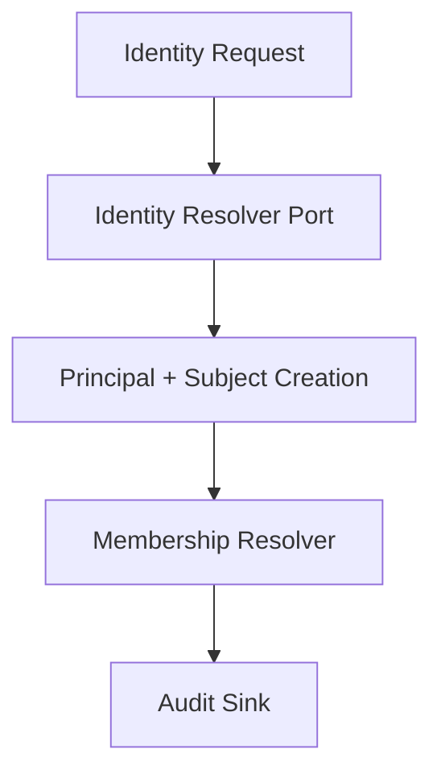
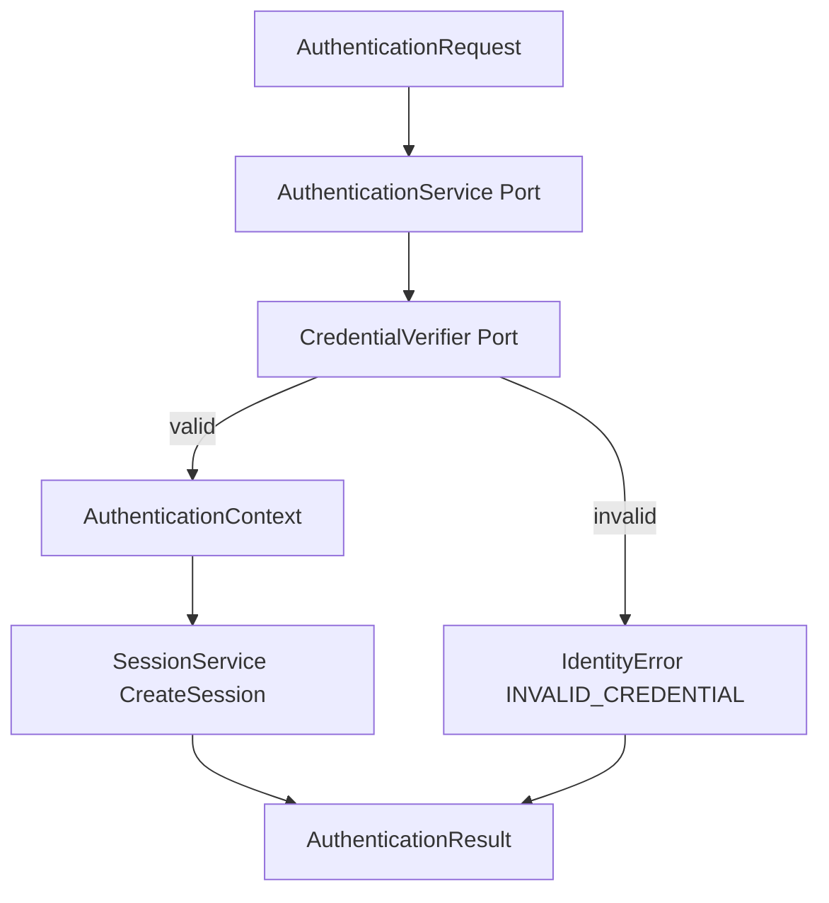
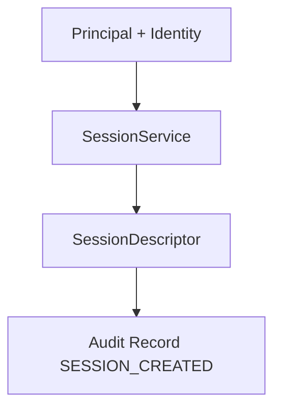
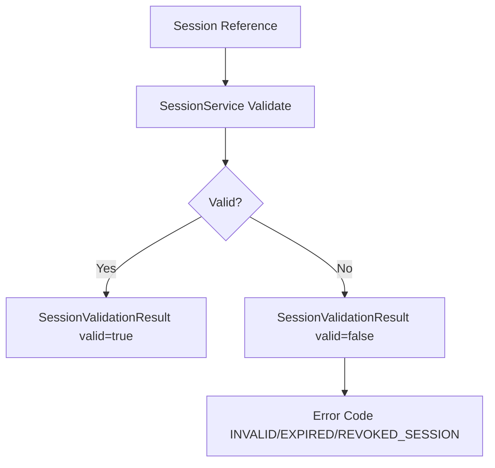
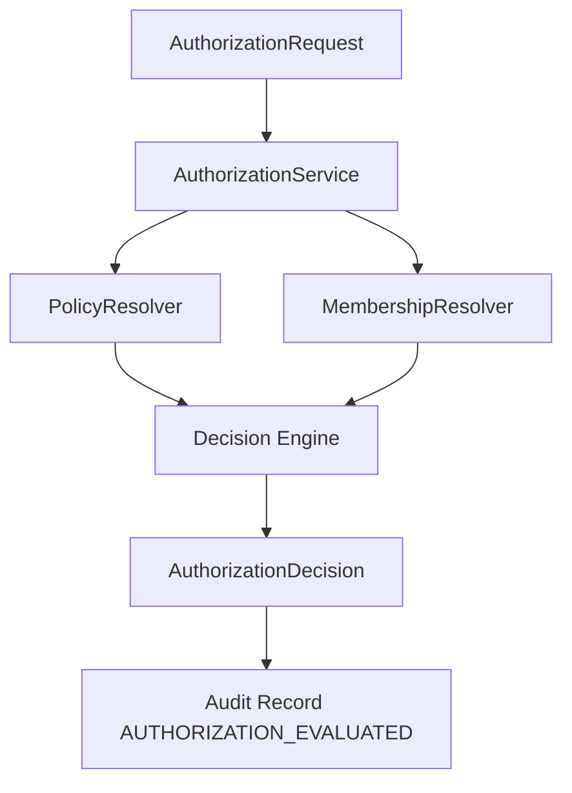
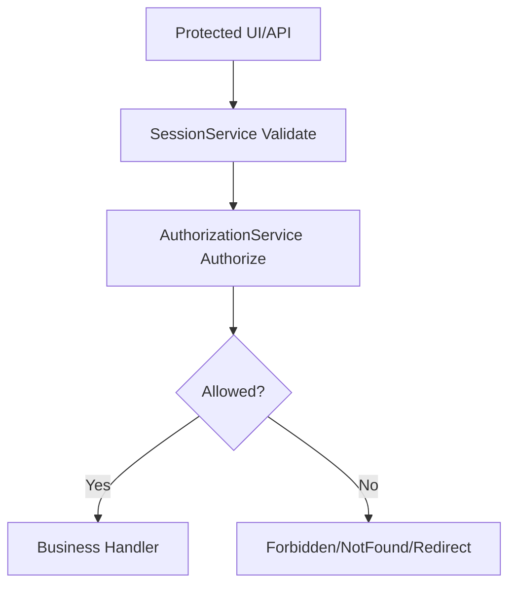
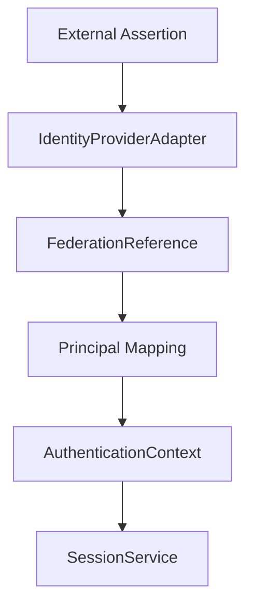
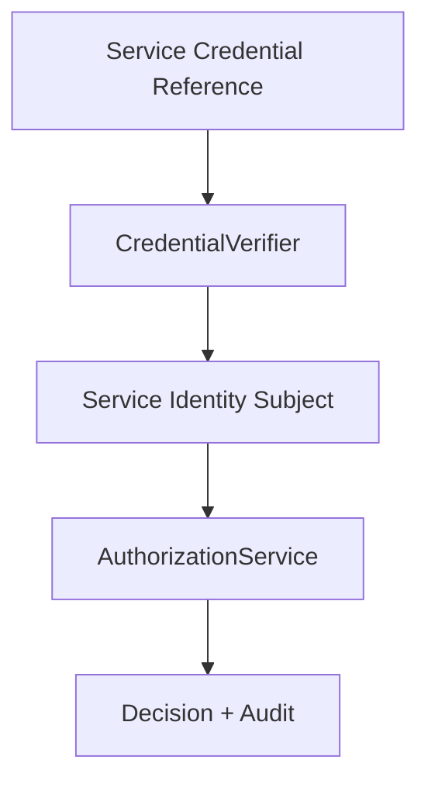
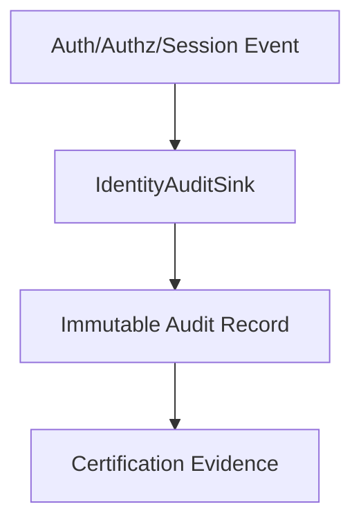

# 09 - Identity Reference Architecture

## Overview
This reference architecture defines canonical identity flows without binding to provider-specific runtime implementation.

## 1) Identity Establishment


## 2) Authentication Flow


## 3) Session Creation


## 4) Session Validation


## 5) Authorization Decision


## 6) Workspace Membership Resolution
```mermaid
flowchart TD
  A[PrincipalId + WorkspaceId] --> B[MembershipResolver]
  B --> C[MembershipDescriptor[]]
  C --> D[AuthorizationService]
```

## 7) Application Access


## 8) External Identity Federation


## 9) Service Identity Flow


## 10) Audit Evidence Flow


## Architecture Constraints
- Identity authority is platform-owned.
- Authentication and authorization are separate contracts.
- Sessions are not identities.
- Credential values are not exposed in public contracts.
- All critical decisions are auditable.
