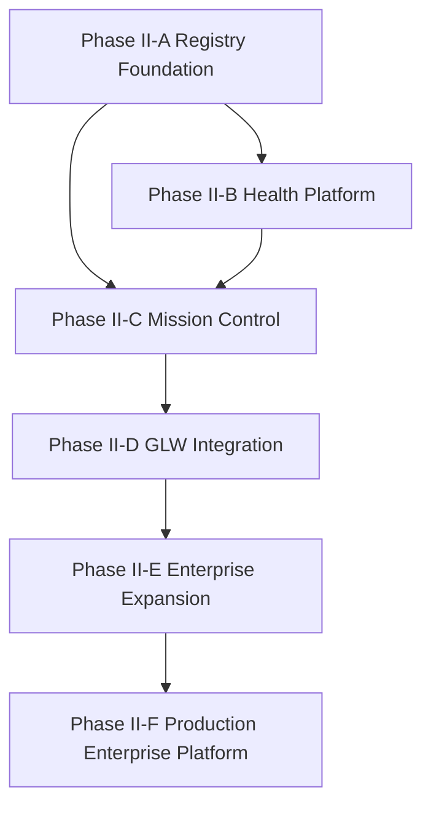
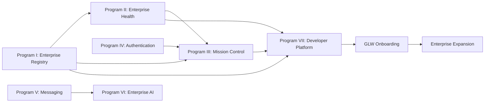

# Genesis Implementation Dependency Graph

Work Order: GPE-0001
Date: 2026-07-30
Status: Planning Dependency Baseline

## Dependency Intent

Document critical path, parallel execution windows, and blocking relationships for Phase II planning and execution governance.

## Critical Path

1. Program I Enterprise Registry
2. Program II Enterprise Health Platform
3. Program III Mission Control
4. Phase II-D GLW Integration
5. Phase II-E Enterprise Expansion
6. Phase II-F Production Enterprise Platform

## High-Level Dependency Graph

## Program Dependency Graph

## Blocking Dependency Register

| Dependency ID | Consumer | Provider | Block Type | Constraint |
|---|---|---|---|---|
| DEP-1001 | EAR-1002 Registry API | EAR-1001 Registry Service | hard | API contract depends on service boundaries |
| DEP-1002 | EAR-1004 Validation | EAR-1002 API and EAR-1003 Persistence | hard | validation rules need stable schema and API fields |
| DEP-1003 | EHC-1001 Health Service | EAR-1002 Registry API | hard | health identity and ownership derive from registry records |
| DEP-1004 | GMC-1001 Dynamic Discovery | EAR-1002 and EAR-1004 | hard | discovery requires valid registry metadata |
| DEP-1005 | GMC-1004 Health Dashboard | EHC-1004 Aggregation Service | hard | dashboard requires aggregated health signals |
| DEP-1006 | GMC-1005 Permission Integration | AUTH identity contracts | hard | permission model depends on identity authority definitions |
| DEP-1007 | GLW onboarding | EAR, EHC, GMC planning closures | hard | onboarding requires complete platform integration blueprint |
| DEP-1008 | Enterprise expansion | GLW integration evidence | hard | expansion depends on proven migration pattern |

## Parallel Work Opportunities

- Authentication governance and messaging architecture may proceed in parallel after Registry and Health schema alignment.
- Developer platform planning can proceed in parallel with Mission Control planning after contract families stabilize.
- AI governance planning can proceed in parallel with messaging planning, gated by policy and identity constraints.

## Constitutional Constraint

No dependency path may introduce capabilities that exceed constitutional authority from GCD-0002, GCD-0003, GCD-0004, GCD-0005, GCF-0001, and GCF-0001A.
