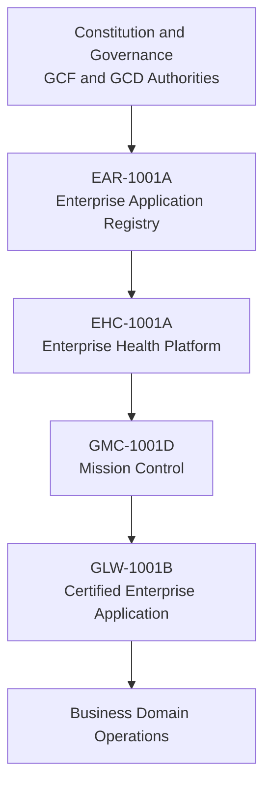

# Architecture Reference - Genesis Platform Baseline 1.0

## Permanent Architecture Model

## Responsibility Boundaries
1. Constitution governs architectural law and authority
2. EAR owns application identity, metadata, lifecycle, and capability declaration authority
3. EHC owns enterprise health, readiness, liveness, compatibility, and aggregation authority
4. GMC owns enterprise orchestration surfaces (workspace, search, dashboard, navigation, launch policy)
5. Applications own business logic, persistence, workflows, and domain APIs

## Ownership Model
1. Platform ownership:
   - Governance
   - Registry
   - Health aggregation
   - Orchestration
2. Application ownership:
   - Business behavior
   - Business data
   - Business process execution

## Service Interactions
1. Applications register metadata via EAR
2. EHC consumes registry metadata and health inputs
3. GMC composes discovery and operational views from EAR and EHC
4. Applications are launched through GMC policy based on certified metadata and health state

## Application Integration Model
1. Register through EAR
2. Participate in health through EHC
3. Expose capabilities via registry contract
4. Become discoverable in GMC
5. Launch through GMC policy
6. Preserve business-domain autonomy

## Platform Layering
1. Constitutional layer
2. Platform services layer
3. Orchestration layer
4. Application integration layer
5. Business domain layer

## Dependency Model
1. Upstream authority cannot depend on downstream consumers
2. Applications must not bypass certified platform services
3. Orchestration must not own application business behavior

## Architectural Constraints
1. No platform-owned business logic
2. No application-owned platform authority
3. Metadata-driven discovery only
4. Centralized launch validation only
5. Certification-before-production governance gate

## Platform Invariants
1. Constitutional boundaries are mandatory
2. Certified dependencies are required
3. Launch safety is fail-closed
4. Health is centrally evaluated
5. Application integration is reproducible and auditable
