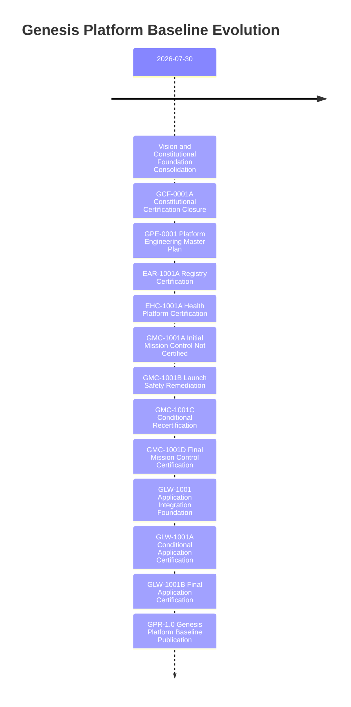

# Genesis Platform Timeline - GPR-1.0

## Evolution Timeline

## Major Milestones
1. Constitutional baseline closure
   - Package: GCF-0001A
   - Outcome: Certified constitutional authority foundation

2. Registry platform certification
   - Package: EAR-1001A
   - Outcome: Certified application metadata authority

3. Health platform certification
   - Package: EHC-1001A
   - Outcome: Certified enterprise health authority

4. Mission control maturity path
   - Packages: GMC-1001A -> GMC-1001B -> GMC-1001C -> GMC-1001D
   - Outcome: Certified orchestration authority

5. First enterprise application certification
   - Packages: GLW-1001 -> GLW-1001A -> GLW-1001B
   - Outcome: First fully certified Genesis application integration

6. Permanent baseline publication
   - Package: GPR-1.0
   - Outcome: Immutable certified reference baseline
