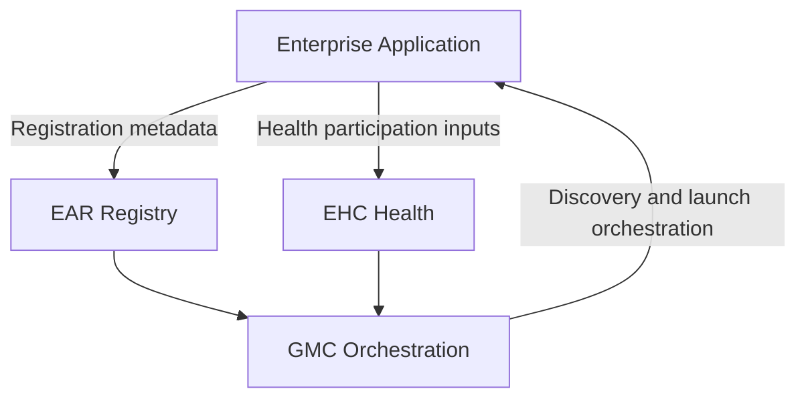

# Enterprise Application Standard - Genesis Platform Baseline 1.0

## Purpose
Canonical integration specification for all future Genesis enterprise applications.

## Required Integration Sequence
1. Register through EAR.
2. Participate in Enterprise Health through EHC.
3. Expose capabilities through registry and health contracts.
4. Become discoverable in GMC.
5. Launch through GMC policy.
6. Preserve business ownership boundaries.
7. Never duplicate platform authority.

## Standard Architecture

## Compliance Requirements
1. Application identity and lifecycle metadata are EAR-authoritative.
2. Health/readiness/liveness/compatibility are EHC-authoritative.
3. Discovery/search/navigation/launch policy are GMC-authoritative.
4. Applications own business APIs, persistence, and workflows.
5. Applications must not implement duplicate registry, health authority, or orchestration authority.

## Future Application Targets
1. SSI
2. STONER
3. RJ Metal
4. Finance
5. Manufacturing
6. CRM
7. Partner Portal
8. Marketing
9. AI-native enterprise applications

## Certification Gate for Applications
1. Platform boundary verification
2. Dependency chain verification
3. Launch safety verification
4. Regression evidence verification
5. Additive certification decision publication
