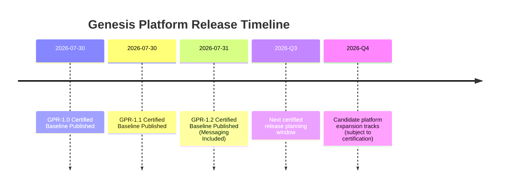

# Future Roadmap

## Release Timeline Update

## Next Planning Themes

1. Expand certified platform capabilities only through formal work-order lifecycle.
2. Preserve dependency chain traceability for all future releases.
3. Continue enforcing deterministic quality gates as release prerequisites.
4. Keep Mission Control and identity compatibility as non-regression requirements.
