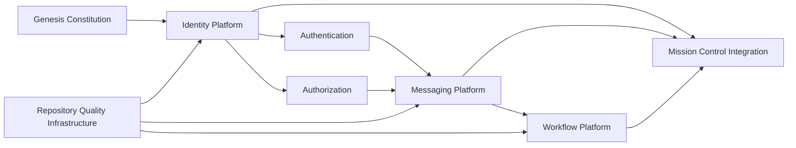

# Architecture Baseline

## Baseline References

1. genesis/architecture/README.md
2. genesis/architecture/GRA-1.0.md
3. genesis/architecture/standards.md
4. genesis/releases/GPR-1.2/04-Architecture-Baseline.md

## Certified Architecture Composition

## Baseline Status

1. Architecture is inherited from GPR-1.2 and extended by certified workflow baseline inclusion.
2. No redesign or interface-breaking change is introduced by this release package.
3. Mission Control compatibility remains preserved.
