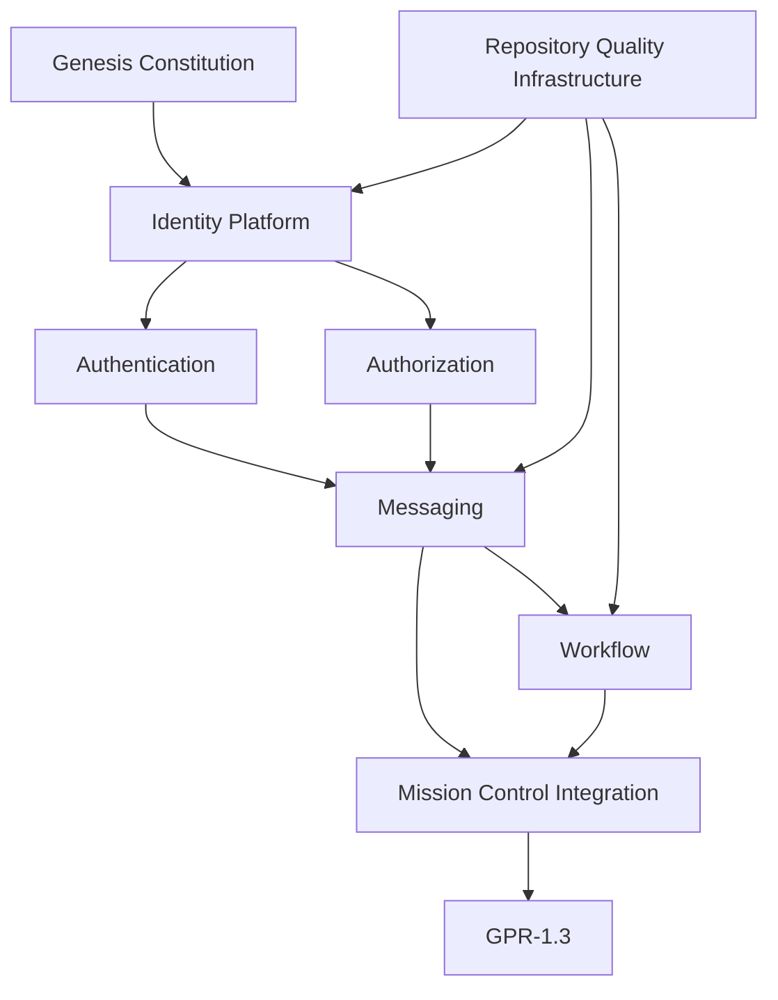

# Certified Dependency Graph

## Certified Dependency Chain

Genesis Constitution
-> Identity Platform (Authentication + Authorization)
-> Messaging Platform
-> Workflow Platform
-> GPR-1.3

Repository Quality Infrastructure underpins all nodes in the chain.
Mission Control integration compatibility is preserved across messaging and workflow certified surfaces.

## Diagram

## Dependency Integrity Outcome

No uncertified dependency is required by the published GPR-1.3 certified baseline.
