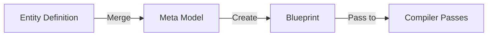

# Genesis Meta Model

## Overview

The **Genesis Meta Model** is the semantic foundation for all Genesis entities.

It defines **canonical properties** that every entity and field should support.

**Core Philosophy**: "Model the business once. Build everything else from it."

The Meta Model makes this possible by establishing universal semantics that all entities inherit.

---

## What is the Meta Model?

The Meta Model is a collection of YAML files that define **semantic properties**, not runtime code.

Each file answers: "What properties must this concept have?"

Files:
- `Entity.meta.yaml` - Universal entity properties
- `Field.meta.yaml` - Universal field properties
- `Relationship.meta.yaml` - Relationship types and properties
- `Capability.meta.yaml` - Optional features entities can enable
- `Lifecycle.meta.yaml` - Entity state machine
- `Permission.meta.yaml` - Access control rules
- `Event.meta.yaml` - Significant occurrences
- `Audit.meta.yaml` - Change tracking
- `Automation.meta.yaml` - Automated workflows
- `Search.meta.yaml` - Discovery features
- `Analytics.meta.yaml` - Metrics and insights
- `AI.meta.yaml` - Intelligent features

---

## Meta Model is Semantic, Not Implementational

**Important**: Meta Model files contain **specifications**, not code.

They describe:
- What properties exist
- What they mean
- Why they matter
- How to use them

They do NOT contain:
- Implementation logic
- Runtime behavior
- Algorithm details
- Technology specifics

**Why?** Because the Meta Model is implementation-independent and enables multiple implementations (databases, APIs, UI frameworks, etc.) to all follow the same semantics.

---

## Entity Inheritance

All entities inherit from `Entity.meta.yaml`.

```
Entity.meta.yaml (Universal Entity Definition)
        ↓
    Customer.entity.yaml (Specific Implementation)
        - Inherits: Identity (id, entityType, businessId, globalId)
        - Inherits: Metadata (name, displayName, description, namespace)
        - Inherits: Properties (fields, relationships, capabilities)
        - Inherits: Behavior (lifecycle, permissions, events, audit, etc.)
        - Inherits: Governance (status, ownership, classification, tags, etc.)
        - Adds: Custom fields (companyName, email, industry, etc.)
        - Adds: Custom relationships (projects, contacts, organization)
        - Adds: Custom capabilities (search, ai, notifications)
```

### How Inheritance Works

When you create `Customer.entity.yaml`, it automatically provides:

```yaml
# From Entity.meta.yaml
id: "Universal identifier"
entityType: "Identifier of this entity type"
businessId: "Business-meaningful identifier"
globalId: "Globally unique identifier"
name: "Display name"
displayName: "User-friendly name"
description: "What is this entity?"
namespace: "Organization namespace"

# Plus relationships to enable:
lifecycle: [Draft, Active, Inactive, Archived, Deleted]
permissions: [Create, Read, Update, Delete, Manage, Export]
audit: [CreatedBy, CreatedAt, ModifiedBy, ModifiedAt]
events: [Created, Updated, Deleted, Archived]

# Plus capabilities to enable:
capabilities: [search, audit, permissions, lifecycle, events]
```

---

## Field Inheritance

All fields inherit from `Field.meta.yaml`.

```
Field.meta.yaml (Universal Field Definition)
        ↓
    Customer.entity.yaml / fields / name (Specific Field)
        - Inherits: Identity (name, displayName, description)
        - Inherits: Data Properties (dataType, required, nullable, default)
        - Inherits: Validation (rules, constraints, format)
        - Inherits: Search & Indexing (searchable, sortable, filterable, indexed)
        - Inherits: Governance (auditable, encrypted, pii, sensitive, classification)
        - Inherits: Visibility (visible, viewableBy, editableBy, exportable)
        - Inherits: AI (aiVisible, aiSearchable, embedding, vectorizable)
        - Inherits: Automation (automationVisible, automationMutable)
```

### How Field Inheritance Works

When you define a field in `Customer.entity.yaml`:

```yaml
fields:
  email:
    dataType: email  # Specifies as email type
    required: true
    # Automatically provides from Field.meta.yaml:
    # - searchable: true (by default)
    # - sortable: true (by default)
    # - indexed: true (by default)
    # - auditable: true (recommended for email)
    # - encrypted: true (recommended for email)
    # - pii: true (marked as PII automatically)
```

---

## How the Meta Model Works With Blueprints

```
Genesis Compilation Pipeline:
    ↓
Entity Definition (GEDL)
    + 
Meta Model (Semantic Properties)
    ↓ (Merge via Blueprint Builder)
Blueprint (Complete Entity Specification)
    ↓ (Pass through 8 compiler passes)
Code Generation (Artifacts)
    ↓
Runtime Entities
```

### Example: Customer Blueprint Generation

1. **Entity Definition** (`Customer.entity.yaml`):
   ```yaml
   fields:
     - name
     - email
     - status
   relationships:
     - organization
   capabilities:
     - search
     - audit
   ```

2. **Entity Meta Model** (`Entity.meta.yaml`):
   ```yaml
   # Provides universal properties:
   - id (identity)
   - createdAt, modifiedAt (audit)
   - lifecycle state machine
   - permission rules
   ```

3. **Field Meta Model** (`Field.meta.yaml`):
   ```yaml
   # Provides for each field:
   - searchable: true
   - indexed: true
   - auditable: true
   - dataType validation
   ```

4. **Capability Meta Models**:
   ```yaml
   # search.meta.yaml provides:
   - Full-text indexing config
   - Faceting configuration
   - Search query support
   
   # audit.meta.yaml provides:
   - Change tracking rules
   - Retention policies
   - Compliance requirements
   ```

5. **Merged Blueprint**:
   ```json
   {
     "entityName": "Customer",
     "fields": [
       {
         "name": "email",
         "dataType": "email",
         "required": true,
         "searchable": true,      // from Field.meta
         "auditable": true,        // from Field.meta
         "encrypted": true,        // from Field.meta
         "pii": true              // from Field.meta
       }
     ],
     "capabilities": [
       "search",       // with full config from Search.meta
       "audit",        // with full config from Audit.meta
       "lifecycle"     // with state machine from Lifecycle.meta
     ],
     "permissions": {     // from Entity.meta
       "create": ["admin", "editor"],
       "read": ["*"],
       "update": ["owner", "admin"]
     }
   }
   ```

6. **Compiler passes** use this merged blueprint to generate code, database schemas, API endpoints, UI forms, etc.

---

## Relationship Between Components

```
┌─────────────────────────────────────────────────────┐
│ Single Source of Truth: GEDL Definition             │
│ (Entity Definition Language)                        │
└────────────┬────────────────────────────────────────┘
             │
        ┌────┴──────────────┬─────────────┬────────────────┐
        │                   │             │                │
    Entity.meta         Field.meta    Relationship    Capability.meta
        │                   │        .meta.yaml            │
        │                   │             │                │
        └────────────┬──────┴─────────────┴────────────────┘
                     │
            ┌────────┴──────────┐
            │ Blueprint Builder │ (Merges all sources)
            └────────┬──────────┘
                     │
              ┌──────┴────────┐
              │  Blueprint    │ (Complete specification)
              │  Entity       │
              └──────┬────────┘
                     │
          ┌──────────┼──────────┐
          │ Compiler Passes    │
          │ (8 passes)         │
          └──────────┼──────────┘
                     │
         ┌───────────┼────────────┐
         │    Code Generation     │
         │  (Artifacts Created)   │
         └───────────┼────────────┘
                     │
              ┌──────┴────────┐
              │  Runtime      │
              │  Entities     │
              └───────────────┘
```

---

## Meta Model Design Philosophy

### 1. **Universality**
Every entity needs these properties.

### 2. **Consistency**
All implementations follow same semantics.

### 3. **Extensibility**
New properties can be added without breaking existing ones.

### 4. **Clarity**
Each property has clear meaning and purpose.

### 5. **Governance**
Properties enable compliance and audit.

### 6. **Interoperability**
Different systems can work together using shared semantics.

---

## Using the Meta Model

### For Entity Architects

Define your entity in GEDL and inherit from Entity.meta.yaml:

```yaml
# Customer.entity.yaml
entity: Customer
inherits: Entity.meta.yaml

fields:
  name:
    type: string
    # Automatically inherits Field.meta properties:
    # searchable, indexed, auditable, etc.
```

### For Field Designers

Define your fields and inherit from Field.meta.yaml:

```yaml
# In entity definition
fields:
  email:
    dataType: email
    # Automatically inherits:
    # - validation rules
    # - search/indexing config
    # - governance rules (PII, encryption)
    # - audit trail
```

### For Capability Enablers

Enable capabilities to inherit their definitions:

```yaml
# In entity definition
capabilities:
  search:
    enabled: true
    # Inherits from Search.meta.yaml:
    # - Full-text search support
    # - Faceting configuration
    # - Autocomplete support

  audit:
    enabled: true
    # Inherits from Audit.meta.yaml:
    # - Change tracking
    # - Compliance requirements
    # - Retention policies
```

---

## Meta Model vs Implementation

**Meta Model** (What the spec says):
- Defined in YAML files
- Semantic only
- Technology-independent
- Used by Blueprint Builder

**Implementation** (What code does):
- Implemented in multiple languages
- Technology-specific (database, APIs, UI)
- Follows Meta Model semantics
- Runs at runtime

**Example**:
- Meta Model says: "email field must be encrypted"
- Implementation detail: "Encrypt using AES-256 in PostgreSQL"

The implementation details can change without changing the Meta Model.

---

## Integration Points

### 1. Blueprint Builder Integration


### 2. Compiler Pass Integration
Each pass uses Meta Model properties:
- **DefinitionRegistryPass**: Loads from GEDL
- **BlueprintPass**: Merges with Meta Model
- **ValidationPass**: Validates against Meta Model
- **RenderingPass**: Uses Meta Model config

### 3. Runtime Integration
Generated code respects Meta Model:
- Audit trail implements Audit.meta.yaml
- Permissions enforce Permission.meta.yaml
- Search implements Search.meta.yaml
- Lifecycle state machine from Lifecycle.meta.yaml

---

## Extending the Meta Model

To add new semantic properties:

1. **Identify the concept** (e.g., "Notification Configuration")
2. **Create a new meta file** (`Notification.meta.yaml`)
3. **Define universal properties** for that concept
4. **Update Entity.meta.yaml** to reference it
5. **Update Blueprint Builder** to merge it

---

## Meta Model Evolution

The Meta Model evolves with Genesis:

- **Phase 10** (Current): Foundation (Entity, Field, Relationship, etc.)
- **Phase 11** (Future): Extensions (Versioning, Replication, Distribution)
- **Phase 12** (Future): AI Integration (Enhanced semantics)
- **Phase 13+** (Future): Domain Models (Industry-specific semantics)

All evolution maintains backward compatibility.

---

## Key Principles

### 1. Semantic Completeness
Every important property is defined.

### 2. Implementation Neutrality
Meta Model doesn't dictate implementation.

### 3. Inheritance by Default
Entities inherit useful defaults.

### 4. Explicit Overrides
Entities can override inherited properties.

### 5. Audit Trail
All meta properties are governed and auditable.

---

## Files in This Directory

```
meta/
├── Entity.meta.yaml          # Universal entity properties
├── Field.meta.yaml           # Universal field properties
├── Relationship.meta.yaml    # Relationship types and properties
├── Capability.meta.yaml      # Optional capabilities
├── Lifecycle.meta.yaml       # State machine
├── Permission.meta.yaml      # Access control
├── Event.meta.yaml           # Significant events
├── Audit.meta.yaml           # Change tracking
├── Automation.meta.yaml      # Workflow automation
├── Search.meta.yaml          # Discovery features
├── Analytics.meta.yaml       # Metrics and insights
├── AI.meta.yaml              # Intelligent features
└── README.md                 # This file
```

---

## Summary

The **Genesis Meta Model** is the foundation that enables Genesis to be a **declarative, semantic, universal platform** for building enterprise systems.

By defining universal properties once in the Meta Model, Genesis can:

1. **Generate code** consistently across all entities
2. **Enforce governance** uniformly
3. **Enable auditing** automatically
4. **Support AI integration** universally
5. **Scale to any domain** by inheritance

The Meta Model embodies Genesis's core principle:

> **"Model the business once. Build everything else from it."**

By modeling the semantics once in the Meta Model, Genesis builds all implementations from that single semantic source.
